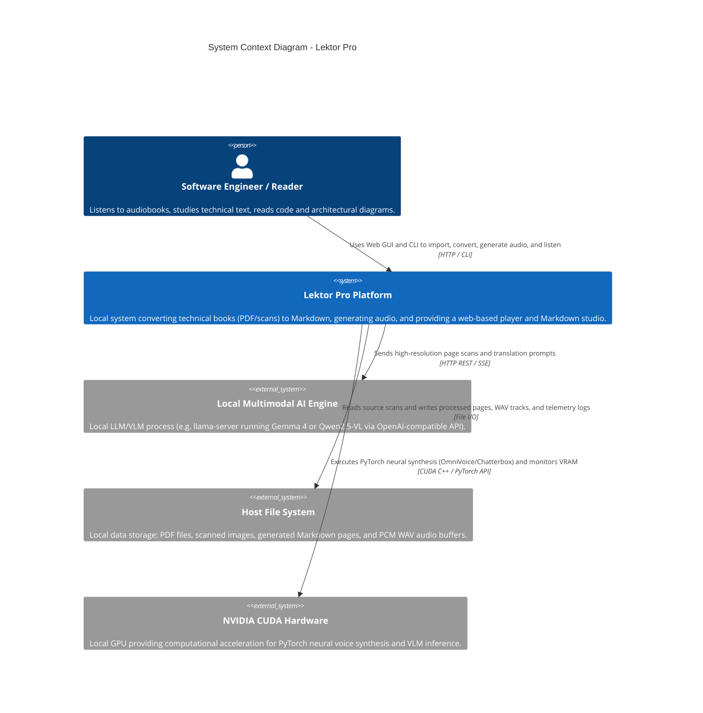

# System context (level 1)

## Overview

The system context diagram shows the high-level boundary of the Lektor Pro application, the primary users, and external integrations. Lektor Pro operates locally on workstation hardware, providing end-to-end processing from raw technical book scans to synthesized speech audio.

## Boundaries and responsibilities

* **User**: Interacts with the platform through the browser UI on port 7860 (or port 80 via local TCP port forwarding) or the CLI console.
* **Lektor Pro**: Core orchestration system implemented in Python 3.14 conforming to clean architecture. It coordinates conversion workflows, linguistic normalization, audio signal cleaning, and dynamic resource leasing.
* **Local multimodal AI engine**: Independent process hosting the visual-language model. It converts scanned page bitmaps to normalized Polish Markdown with preserved Go code listings and Mermaid diagrams.
* **Host file system**: Single source of truth for all persistent entities organized under `data/books/<slug>/`.
* **NVIDIA CUDA hardware**: Dedicated hardware accelerator shared sequentially by VLM and TTS models via the dynamic VRAM arbiter.
