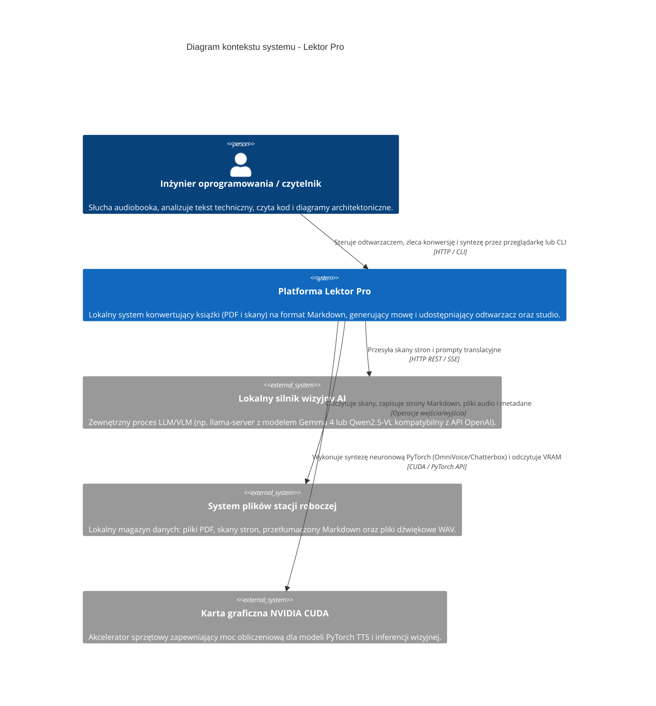

# Kontekst systemu (poziom 1)

## Przegląd

Diagram kontekstu przedstawia granice platformy Lektor Pro na najwyższym poziomie abstrakcji, jej użytkowników oraz integracje zewnętrzne. Aplikacja działa lokalnie na stacji roboczej, realizując pełny potok przetwarzania od surowych skanów książek technicznych do zsyntetyzowanego głosu lektora.



## Granice i odpowiedzialności

* **Użytkownik**: Korzysta z systemu przez graficzny interfejs przeglądarkowy na porcie 7860 (lub porcie 80 przez przekierowanie TCP) oraz konsolę CLI.
* **Platforma Lektor Pro**: Centralna jednostka orkiestracji napisana w Pythonie 3.14 w czystej architekturze. Koordynuje konwersję, normalizację tekstu, oczyszczanie sygnału audio oraz arbitraż pamięci karty graficznej.
* **Lokalny silnik wizyjny AI**: Niezależny proces inferencyjny analizujący skany stron i generujący sformatowany tekst w języku polskim z zachowaniem kodu źródłowego i diagramów Mermaid.
* **System plików**: Pojedyncze źródło prawdy zorganizowane w strukturze katalogów `data/books/<slug>/`.
* **Karta graficzna NVIDIA CUDA**: Fizyczny zasób obliczeniowy współdzielony naprzemiennie przez modele wizyjne i syntezatory mowy.
iczną strukturą katalogów (`data/books/<slug>/`).

```

---ia.
