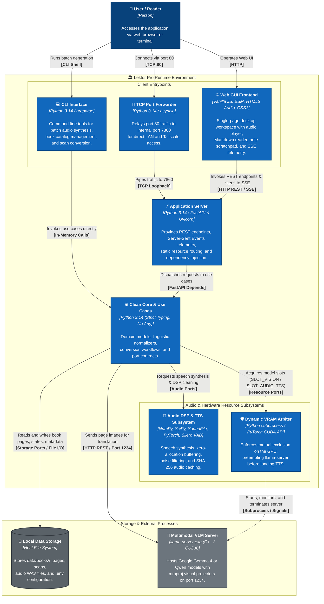

# Container diagram (level 2)

## Overview

The container diagram illustrates the runtime boundaries, technologies, and inter-process communication mechanisms comprising Lektor Pro.

## Runtime containers

1. **Web GUI frontend**: Built with native modern JavaScript (ES modules) and styled with CSS custom properties. It manages audio playback, time scrubbing, and window management without single-page application framework overhead.
2. **Application server (FastAPI)**: Serves assets, coordinates background workers with `threading.Thread`, and streams conversion metrics via `SseTelemetryBroadcasterAdapter`.
3. **TCP port forwarder**: A lightweight `asyncio` loop enabling access on standard HTTP port 80 alongside the primary port 7860.
4. **Clean core and use cases**: Domain services and application interactors with strict type checking, relying on port abstractions.
5. **Audio DSP and TTS subsystem**: Combines neural speech generation with digital signal processing (DSP) filters and content-addressable storage.
6. **Dynamic VRAM arbiter**: Coordinates execution between VLM processes and in-process PyTorch models on memory-constrained GPUs.

---

## ⚙️ Container Specifications

| Container | Technology Stack | Network / Interface | Primary Responsibility |
| --- | --- | --- | --- |
| **Web GUI Frontend** | Vanilla JS (ESM), CSS3, HTML5 | In-browser DOM | Serves the window manager, audio player, markdown viewer, and real-time SSE listener. |
| **Port Forwarder** | Python `asyncio` (`port_forwarder.py`) | TCP `0.0.0.0:80` $\to$ `127.0.0.1:7860` | Allows seamless LAN access without specifying custom port numbers in mobile browsers. |
| **API & Application Server** | FastAPI, Uvicorn, Python 3.14 | HTTP `127.0.0.1:7860` | Exposes REST endpoints, validates Pydantic schemas, and manages worker threads (`JobExecutionManager`). |
| **CLI Runner** | Python `argparse` (`main.py`) | Standard CLI | Executes batch conversion and synthesis pipelines in headless automated environments. |
| **VRAM Resource Arbiter** | Python (`DynamicVramModelArbiter`) | Internal Protocol | Coordinates hardware preemption to prevent out-of-memory errors on consumer GPUs. |
| **Vision Model Runtime** | `llama-server.exe` (CUDA 12) | HTTP `127.0.0.1:1234/v1` | Performs multimodal vision OCR and technical translation into Polish Markdown. |
| **TTS & DSP Engine** | PyTorch, SciPy, NumPy, SoundFile | In-process CUDA / CPU | Synthesizes speech, cleans audio tails via Silero VAD, and normalizes output volume. |
| **File System Repository** | Host OS Filesystem | Directory Hierarchy | Canonical storage holding metadata, 300 DPI scans, generated markdown files, and audio tracks. |
