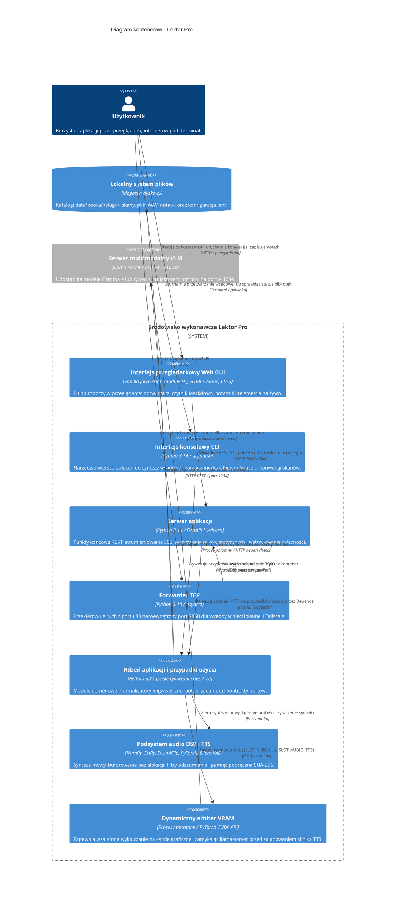

# Diagram kontenerów (poziom 2)

## Przegląd

Diagram kontenerów ilustruje podział systemu Lektor Pro na jednostki wykonawcze, użyte technologie oraz komunikację międzyprocesową.

## Kontenery systemu

1. **Interfejs przeglądarkowy Web GUI**: Zbudowany w czystym JavaScripcie (moduły ES) bez frameworków SPA. Odpowiada za odtwarzanie dźwięku, synchronizację z systemem oraz zarządzanie oknami pulpitu.
2. **Serwer aplikacji (FastAPI)**: Udostępnia punkty końcowe REST, zarządza wątkami roboczymi `threading.Thread` i strumieniuje telemetrię postępu przez `SseTelemetryBroadcasterAdapter`.
3. **Forwarder TCP**: Lekki serwer asynchroniczny `asyncio` pozwalający na dostęp do systemu pod portem 80 obok portu 7860.
4. **Rdzeń aplikacji i przypadki użycia**: Usługi domenowe i interaktory operujące wyłącznie na abstrakcjach portów ze ścisłą kontrolą typów.
5. **Podsystem audio DSP i TTS**: Łączy neuronową generację mowy z filtrami cyfrowego przetwarzania sygnałów i pamięcią podręczną adresowaną haszem SHA-256.
6. **Dynamiczny arbiter VRAM**: Kontroluje obecność modeli w pamięci karty graficznej, eliminując błędy braku pamięci (OOM).
