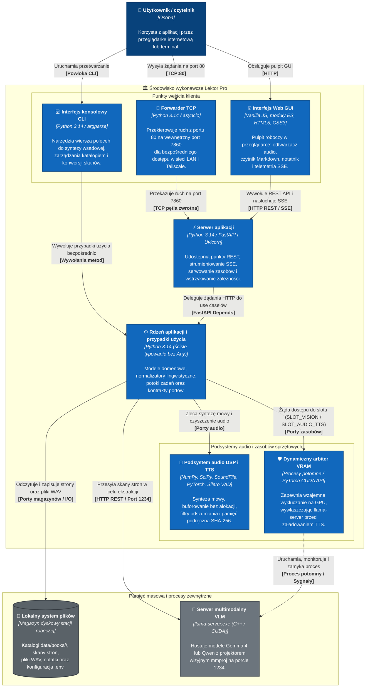

# Diagram kontenerów (poziom 2)

## Przegląd

Diagram kontenerów ilustruje podział systemu Lektor Pro na jednostki wykonawcze, użyte technologie oraz komunikację międzyprocesową.

## Kontenery systemu

1. **Interfejs przeglądarkowy Web GUI**: Zbudowany w czystym JavaScripcie (moduły ES) bez frameworków SPA. Odpowiada za odtwarzanie dźwięku, synchronizację z systemem oraz zarządzanie oknami pulpitu.
2. **Serwer aplikacji (FastAPI)**: Udostępnia punkty końcowe REST, zarządza wątkami roboczymi `threading.Thread` i strumieniuje telemetrię postępu przez `SseTelemetryBroadcasterAdapter`.
3. **Forwarder TCP**: Lekki serwer asynchroniczny `asyncio` pozwalający na dostęp do systemu pod portem 80 obok portu 7860.
4. **Rdzeń aplikacji i przypadki użycia**: Usługi domenowe i interaktory operujące wyłącznie na abstrakcjach portów ze ścisłą kontrolą typów.
5. **Podsystem audio DSP i TTS**: Łączy neuronową generację mowy z filtrami cyfrowego przetwarzania sygnałów i pamięcią podręczną adresowaną haszem SHA-256.
6. **Dynamiczny arbiter VRAM**: Kontroluje obecność modeli w pamięci karty graficznej, eliminując błędy braku pamięci (OOM).

---

## ⚙️ Specyfikacja techniczna kontenerów

| Kontener | Stos technologiczny | Interfejs / Port | Główna odpowiedzialność |
| --- | --- | --- | --- |
| **Web GUI Frontend** | Vanilla JS (ESM), CSS3, HTML5 | DOM przeglądarki | Menedżer okien pulpitu, odtwarzacz audio, czytnik Markdown i nasłuchiwanie SSE. |
| **Forwarder TCP** | Python `asyncio` (`port_forwarder.py`) | TCP `0.0.0.0:80` $\to$ `127.0.0.1:7860` | Dostęp w sieci lokalnej bez konieczności podawania portu w przeglądarkach mobilnych. |
| **Serwer aplikacji API** | FastAPI, Uvicorn, Python 3.14 | HTTP `127.0.0.1:7860` | Punkty końcowe REST, walidacja Pydantic i zarządzanie wątkami roboczymi. |
| **Konsola CLI** | Python `argparse` (`main.py`) | CLI powłoki | Wsadowe potoki przetwarzania i syntezy w środowiskach bez interfejsu graficznego. |
| **Arbiter zasobów VRAM** | Python (`DynamicVramModelArbiter`) | Protokół wewnętrzny | Wywłaszczanie modeli na karcie graficznej w celu uniknięcia błędów OOM. |
| **Silnik wizyjny AI** | `llama-server.exe` (CUDA 12) | HTTP `127.0.0.1:1234/v1` | Multimodalny OCR skanów i tłumaczenie techniczne na polski Markdown. |
| **Silnik TTS i DSP** | PyTorch, SciPy, NumPy, SoundFile | Biblioteki w procesie | Synteza mowy, odszumianie Silero VAD i normalizacja głośności. |
| **Magazyn plików** | System plików systemu operacyjnego | Hierarchia katalogów | Przechowywanie skanów 300 DPI, wygenerowanych plików Markdown i ścieżek WAV. |
