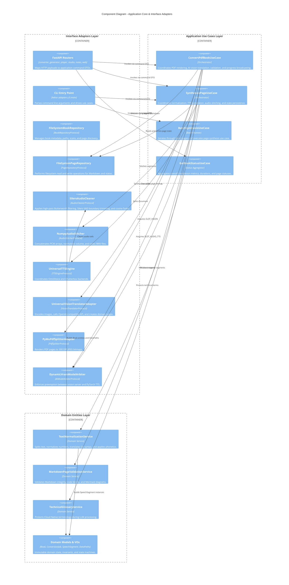

# Component diagrams (level 3)

## Overview

The component view details the internal decomposition of the application core, demonstrating strict compliance with clean architecture layer boundaries.

## Layer boundary analysis

* **Domain layer**: Contains entities, value objects, and domain services. It has zero external dependencies on third-party frameworks.
* **Application layer**: Defines ports as abstract protocols (`typing.Protocol`) and orchestrates use cases through command and query objects (DTOs).
* **Interface adapters layer**: Converts low-level payloads from HTTP, CLI, file systems, and hardware drivers into domain and application structures.
