# Diagram komponentów (poziom 3)

## Przegląd

Diagram komponentów przedstawia wewnętrzną dekompozycję rdzenia aplikacji oraz warstw architektury, w pełni odzwierciedlając regułę zależności Czystej Architektury (Clean Architecture).

```mermaid
flowchart TB
    classDef adapter fill:#08427b,stroke:#073b6f,color:#fff,stroke-width:2px;
    classDef usecase fill:#1168bd,stroke:#0b4884,color:#fff,stroke-width:2px;
    classDef domain fill:#1f7a8c,stroke:#14525e,color:#fff,stroke-width:2px;
    classDef gateway fill:#5a6268,stroke:#343a40,color:#fff,stroke-width:2px;

    subgraph DrivingAdapters [" 🌐 Adaptery wejściowe (Driving / Ingress) "]
        direction LR
        guiRouters["⚡ <b>Routery FastAPI</b><br/><i>[Web GUI REST / SSE DTO]</i>"]:::adapter
        cliMain["💻 <b>Punkt wejściowy CLI</b><br/><i>[lektor.adapters.cli.main]</i>"]:::adapter
    end

    subgraph AppLayer [" ⚙️ Warstwa przypadków użycia (Application Layer) "]
        direction LR
        ucConvert["📄 <b>ConvertPdfBookUseCase</b><br/><i>[Orkiestrator konwersji PDF]</i>"]:::usecase
        ucSynthPage["🎙️ <b>SynthesizePageUseCase</b><br/><i>[Orkiestrator syntezy strony]</i>"]:::usecase
        ucBatchSynth["📦 <b>BatchSynthesisUseCase</b><br/><i>[Przetwarzanie wsadowe]</i>"]:::usecase
        ucStatus["📊 <b>GetBookStatusUseCase</b><br/><i>[Agregacja statusu książki]</i>"]:::usecase
    end

    subgraph DomainLayer [" 🏛️ Warstwa encji i reguł (Domain Layer) "]
        direction TB
        normalizer["🔤 <b>TextNormalizationService</b><br/><i>[Normalizacja tekstu i fonetyzacja Go]</i>"]:::domain
        validator["🛡️ <b>MarkdownPageValidationService</b><br/><i>[Walidacja integralności i Mermaid]</i>"]:::domain
        glossary["📚 <b>TechnicalGlossaryService</b><br/><i>[Ochrona terminów Cloud Native]</i>"]:::domain
        entities["🧱 <b>Modele domenowe i VO</b><br/><i>[Book, ConversionJob, SpeechSegment, DataPaths]</i>"]:::domain
    end

    subgraph DrivenAdapters [" 🔌 Adaptery wyjściowe i sterowniki (Driven / Infrastructure) "]
        direction TB
        pageRepo["💾 <b>FileSystemPageRepository</b><br/><i>[PageRepositoryProtocol]</i>"]:::gateway
        bookRepo["📁 <b>FileSystemBookRepository</b><br/><i>[BookRepositoryProtocol]</i>"]:::gateway
        universalTTS["🗣️ <b>UniversalTTSEngine</b><br/><i>[TTSEngineProtocol: OmniVoice / Chatterbox]</i>"]:::gateway
        audioCleaner["🧹 <b>SileroAudioCleaner</b><br/><i>[AudioCleanerProtocol: VAD i filtry]</i>"]:::gateway
        audioStitcher["🪡 <b>NumpyAudioStitcher</b><br/><i>[AudioStitcherProtocol: normalizacja WAV]</i>"]:::gateway
        visionAdapter["👁️ <b>UniversalVisionTranslatorAdapter</b><br/><i>[VisionTranslatorProtocol: OpenAI API]</i>"]:::gateway
        pdfSplitter["📑 <b>PyMuPdfSplitterAdapter</b><br/><i>[PdfSplitterProtocol: 300 DPI JPEG]</i>"]:::gateway
        arbiter["⚖️ <b>DynamicVramModelArbiter</b><br/><i>[AIModelArbiterProtocol: wywłaszczanie VRAM]</i>"]:::gateway
    end

    guiRouters -->|"Wywołuje przez DTO"| ucConvert
    guiRouters -->|"Wywołuje przez DTO"| ucSynthPage
    guiRouters -->|"Wywołuje przez DTO"| ucStatus
    cliMain -->|"Wywołuje przez DTO"| ucSynthPage
    cliMain -->|"Wywołuje przez DTO"| ucBatchSynth
    ucBatchSynth -->|"Wykonuje w pętli"| ucSynthPage

    ucConvert -->|"Podział stron PDF"| pdfSplitter
    ucConvert -->|"Tłumaczenie skanów"| visionAdapter
    ucConvert -->|"Wywłaszczenie GPU"| arbiter
    ucConvert -->|"Zapis stron"| pageRepo
    ucConvert -->|"Walidacja treści"| validator
    ucConvert -->|"Słownik pojęć"| glossary

    ucSynthPage -->|"Segmentacja mowy"| normalizer
    ucSynthPage -->|"Synteza audio"| universalTTS
    ucSynthPage -->|"Łączenie próbek WAV"| audioStitcher
    ucSynthPage -->|"Stan strony"| pageRepo
    ucSynthPage -->|"Rezerwacja VRAM"| arbiter

    universalTTS -->|"Czyszczenie próbek"| audioCleaner
    normalizer -->|"Tworzy instancje"| entities
    bookRepo -->|"Buduje modele"| entities
```

## Analiza granic warstw

* **Warstwa domeny (Entities Layer)**: Zawiera encje, obiekty wartości (VO) oraz bezstanowe usługi domenowe. Jest całkowicie odizolowana od frameworków, baz danych i wejścia/wyjścia.
* **Warstwa aplikacji (Use Cases Layer)**: Definiuje abstrakcyjne kontrakty portów (`typing.Protocol`) i orkiestruje przepływ danych przy pomocy dedykowanych komend i zapytań DTO.
* **Warstwa adapterów interfejsów (Interface Adapters Layer)**: Tłumaczy dane zewnętrzne (HTTP REST, CLI, system plików, akceleratory sprzętowe) na struktury domenowe i implementuje porty wyjściowe.
