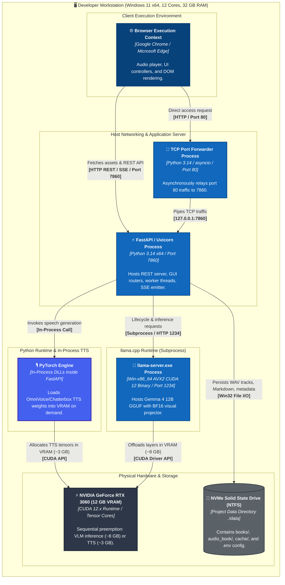

# Deployment topology (level 4)

## Overview

The deployment diagram illustrates the physical deployment topology on a developer workstation running Windows with an NVIDIA GPU accelerator.

## Hardware and process allocation

* **FastAPI / Uvicorn process (port 7860)**: Core application process executing use cases, coordinating background threads with `threading.Thread`, and reading filesystem paths.
* **Port forwarder process (port 80)**: Enables local network access without explicit port specifications in the address bar.
* **Multimodal server subprocess (`llama-server.exe`, port 1234)**: Launched on demand by `ProcessModelHandle` when entering `SLOT_VISION`. It is cleanly terminated before speech synthesis begins.
* **PyTorch in-process engine**: Loaded by `PyTorchModelHandle` during `SLOT_AUDIO_TTS`. Memory is actively cleared via garbage collection and CUDA cache flush calls when the slot is released.
* **Single GPU constraint**: Because both models cannot simultaneously reside in 12 GB VRAM without out-of-memory errors, the deployment relies on hardware-level mutual exclusion.
