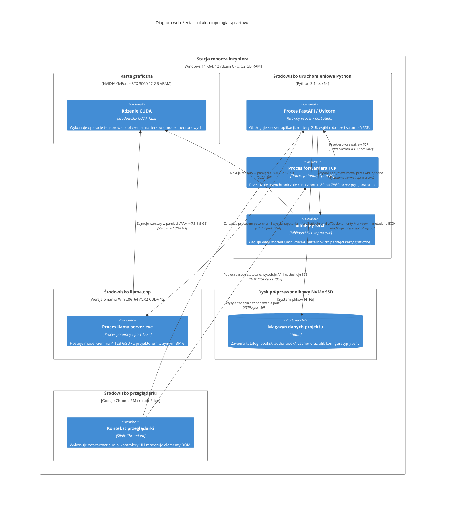

# Topologia wdrożenia (poziom 4)

## Przegląd

Diagram wdrożenia przedstawia fizyczną topologię uruchomieniową platformy na lokalnej stacji roboczej wyposażonej w kartę graficzną NVIDIA.

## Alokacja procesów i zasobów

* **Główny proces FastAPI / Uvicorn (port 7860)**: Odpowiada za wykonywanie przypadków użycia, koordynację wątków roboczych `threading.Thread` oraz zapis plików.
* **Proces forwardera TCP (port 80)**: Umożliwia dostęp do interfejsu w sieci lokalnej bez konieczności wpisywania numeru portu w przeglądarce.
* **Proces serwera multimodalnego (`llama-server.exe`, port 1234)**: Uruchamiany automatycznie przez `ProcessModelHandle` przy wejściu do slotu `SLOT_VISION`. Jest bezpiecznie zamykany przed rozpoczęciem syntezy mowy.
* **Wewnątrzprocesowy silnik PyTorch**: Ładowany przez `PyTorchModelHandle` w slocie `SLOT_AUDIO_TTS`. Pamięć jest jawnie zwalniana za pomocą odśmiecacza pamięci i czyszczenia pamięci podręcznej CUDA.
* **Ograniczenia pamięci GPU**: Ze względu na fizyczny limit 12 GB pamięci VRAM, jednoczesne utrzymanie obu modeli doprowadziłoby do błędu braku pamięci (OOM). Topologia wdrożenia opiera się na sekwencyjnym wywłaszczaniu zasobów na poziomie systemu operacyjnego.
