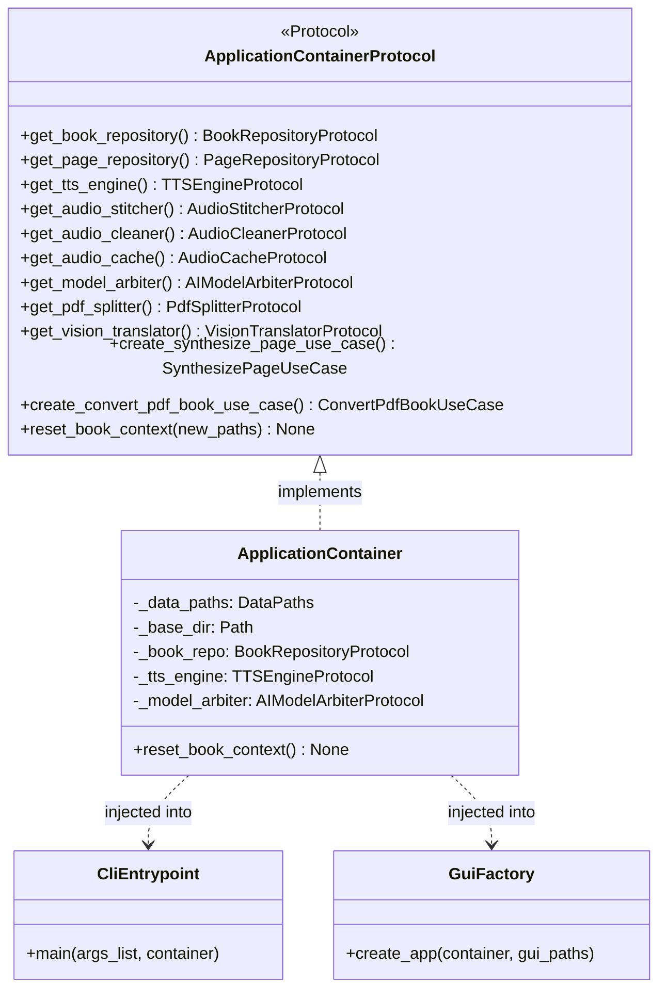

# Composition root & inversion of control

## Overview

The composition root is the centralized location where dependencies are resolved and instantiated. In Lektor Pro, this responsibility belongs to `ApplicationContainer`, located in `lektor.infrastructure.container`.

## Composition pattern

Lektor Pro avoids hidden singletons and ambient global state by adopting explicit dependency injection:

1. **Pure protocol contracts**: The application layer defines `ApplicationContainerProtocol` in `lektor.application.ports.container_ports`. Neither use cases nor interface adapters depend on concrete infrastructure classes.
2. **Context-aware lifecycle**: The active book context can be switched dynamically at runtime without restarting the process. Calling `reset_book_context` clears cached repositories (`_book_repo`, `_page_repo`, `_notes_repo`) and rebinds paths to the target book directory (`data/books/<slug>/`).
3. **Dual entry-point injection**:
* **CLI (`main.py`)**: Passes `default_container` directly to `lektor.adapters.cli.main.main(..., container=default_container)`.
* **Web GUI (`lektor.adapters.gui.app`)**: Binds the container into FastAPI application state via `app.state.container = container`. Route handlers resolve components cleanly through `fastapi.Depends(get_container)`.

