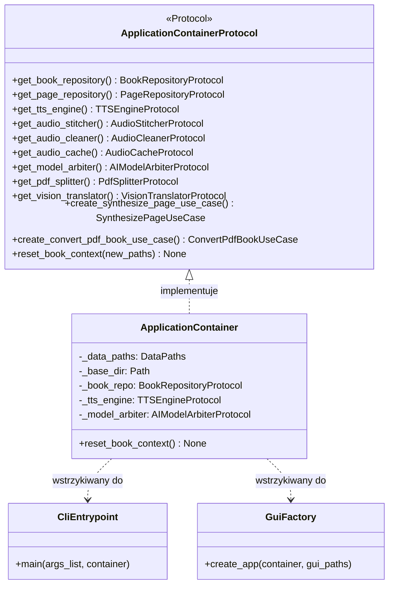

# Punkt składania aplikacji i odwrócenie sterowania (IoC)

## Przegląd

Punkt składania aplikacji (ang. *composition root*) to wyznaczone miejsce w kodzie, w którym następuje powiązanie abstrakcji z konkretnymi implementacjami i inicjalizacja grafu zależności. W projekcie Lektor Pro rolę tę pełni klasa `ApplicationContainer` z modułu `lektor.infrastructure.container`.

## Wzorzec składania zależności

Architektura systemu eliminuje ukryte singletony i niekontrolowany stan globalny poprzez jawne wstrzykiwanie zależności:

1. **Czyste kontrakty protokołów**: Warstwa aplikacji definiuje kontrakt `ApplicationContainerProtocol` w `lektor.application.ports.container_ports`. Ani przypadki użycia, ani adaptery interfejsów nie zależą od klas infrastrukturalnych.
2. **Cykl życia kontekstu książki**: Kontekst aktywnej książki może być przełączany w czasie działania programu bez konieczności restartu procesu. Wywołanie metody `reset_book_context` unieważnia instancje repozytoriów powiązanych z bieżącą książką (`_book_repo`, `_page_repo`, `_notes_repo`) i wiąże ścieżki z nowym katalogiem docelowym (`data/books/<slug>/`).
3. **Wstrzykiwanie w punktach wejścia**:
* **Konsola CLI (`main.py`)**: Przekazuje `default_container` bezpośrednio jako argument funkcji głównej: `lektor.adapters.cli.main.main(..., container=default_container)`.
* **Interfejs przeglądarkowy (`lektor.adapters.gui.app`)**: Zapisuje instancję kontenera w stanie aplikacji FastAPI (`app.state.container = container`). Routery pobierają serwisy za pośrednictwem mechanizmu `fastapi.Depends(get_container)`.

