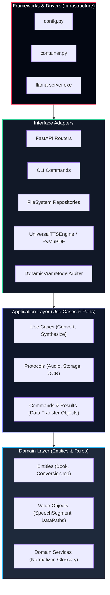

# Dependency rule enforcement

## Overview

The dependency rule is the foundational invariant of clean architecture: source code dependencies must point exclusively inward toward higher-level policies. Inner layers know nothing about outer layers.



## Layer boundary definitions

| Layer | Directory | Permitted dependencies | Strictly forbidden dependencies |
| --- | --- | --- | --- |
| **Domain** | `lektor/domain/` | Python standard library only | Any external library, frameworks, filesystem I/O, network, application, adapters, infrastructure |
| **Application** | `lektor/application/` | `lektor/domain/`, Python standard library | Web frameworks (`fastapi`), machine learning frameworks (`torch`), I/O adapters, infrastructure |
| **Interface Adapters** | `lektor/adapters/` | `lektor/application/`, `lektor/domain/`, specialized I/O drivers (`pymupdf`, `soundfile`, `scipy`) | `lektor/infrastructure/` (no outward coupling) |
| **Frameworks & Drivers** | `lektor/infrastructure/` | `lektor/adapters/`, `lektor/application/`, `lektor/domain/` | None (outermost wiring layer) |

## Automated architecture validation

Compliance with the dependency rule is verified automatically in the CI pipeline using `import-linter`. The contract defined in `.importlinter` ensures that prohibited import paths fail static analysis:

```ini
[importlinter]
root_package = lektor

[importlinter:contract:clean-architecture-layers]
name = Clean Architecture Layer Dependencies
type = layers
layers =
    lektor.infrastructure
    lektor.adapters
    lektor.application
    lektor.domain
containers =
    lektor
```