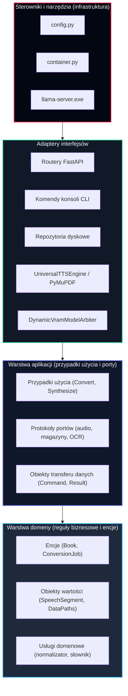

# Wymuszanie reguły zależności

## Przegląd

Reguła zależności (ang. *dependency rule*) stanowi nadrzędny niezmiennik czystej architektury: zależności w kodzie źródłowym mogą biec wyłącznie do wewnątrz, w kierunku logiki biznesowej wyższego poziomu. Warstwy wewnętrzne nie mają żadnej wiedzy o istnieniu warstw zewnętrznych.



## Podział odpowiedzialności i dopuszczalne zależności

| Warstwa | Ścieżka | Dopuszczalne zależności | Bezwzględnie zabronione zależności |
| --- | --- | --- | --- |
| **Domena** | `lektor/domain/` | Wyłącznie biblioteka standardowa Pythona | Biblioteki zewnętrzne, frameworki, operacje I/O, sieć, warstwa aplikacji, adaptery, infrastruktura |
| **Aplikacja** | `lektor/application/` | `lektor/domain/`, biblioteka standardowa Pythona | Frameworki WWW (`fastapi`), biblioteki uczenia maszynowego (`torch`), adaptery wejścia/wyjścia, infrastruktura |
| **Adaptery interfejsów** | `lektor/adapters/` | `lektor/application/`, `lektor/domain/`, dedykowane sterowniki wejścia/wyjścia (`pymupdf`, `soundfile`, `scipy`) | `lektor/infrastructure/` (całkowity zakaz zależności na zewnątrz) |
| **Infrastruktura** | `lektor/infrastructure/` | `lektor/adapters/`, `lektor/application/`, `lektor/domain/` | Brak (najbardziej zewnętrzna warstwa spajająca) |

## Automatyczna weryfikacja architektury

Przestrzeganie reguły zależności jest automatycznie sprawdzane w potoku ciągłej integracji za pomocą narzędzia `import-linter`. Reguła zdefiniowana w pliku `.importlinter` natychmiast przerywa weryfikację w przypadku wykrycia niedozwolonego importu:

```ini
[importlinter]
root_package = lektor

[importlinter:contract:clean-architecture-layers]
name = Clean Architecture Layer Dependencies
type = layers
layers =
    lektor.infrastructure
    lektor.adapters
    lektor.application
    lektor.domain
containers =
    lektor

```


Polecenie `lint-imports` automatycznie potwierdza poprawność kierunku zależności w całym projekcie.

