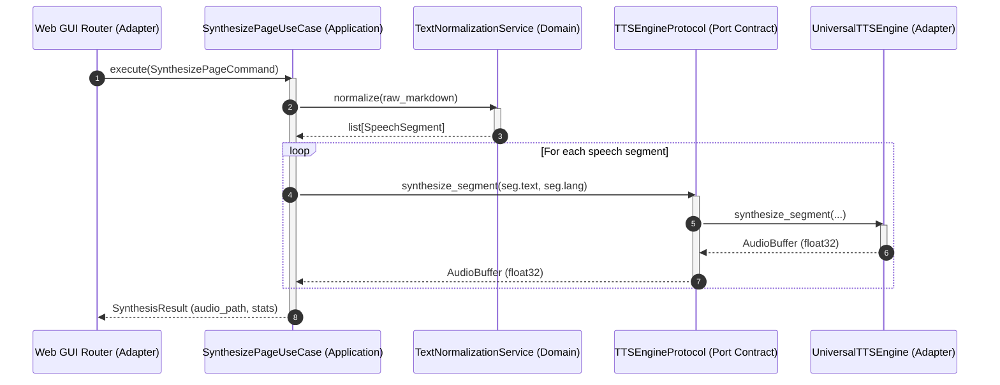

# Layer boundaries & contracts

## Overview

Communication across layer boundaries in Lektor Pro relies on decoupled data contracts and structural typing interfaces (`typing.Protocol`).



## Contract taxonomy

### 1. Inbound contracts: Commands and queries (DTOs)

The application layer consumes immutable data structures (`frozen=True` dataclasses). Adapters convert incoming HTTP request bodies or command-line parameters into these command objects:

* `SynthesizePageCommand`: Specifies source markdown path, target audio output directory, format, and overwrite rules.
* `StartConversionCommand`: Carries document input path, book slug, DPI resolution, and page range parameters.
* `PreviewPageQuery`: Represents requests for normalized segmentation without running synthesis models.

### 2. Outbound contracts: Application ports (Protocols)

Use cases never instantiate physical drivers or file handlers directly. Instead, they interact with abstract port protocols defined in `lektor.application.ports`:

* `TTSEngineProtocol`: Declares `load_model()`, `unload_model()`, `synthesize_segment()`, and `is_loaded()`.
* `BookRepositoryProtocol`: Declares querying and persistence operations across the book catalog.
* `AIModelArbiterProtocol`: Governs access to physical accelerator resources without exposing CUDA handles.

### 3. Data boundary isolation

Domain entities returned to interface adapters are read-only or transferred via domain value objects (`SynthesisResult`, `SynthesisStats`, `BookMetadataDTO`). Interface adapters (such as FastAPI routers) serialize these objects into Pydantic models for client consumption.

```
