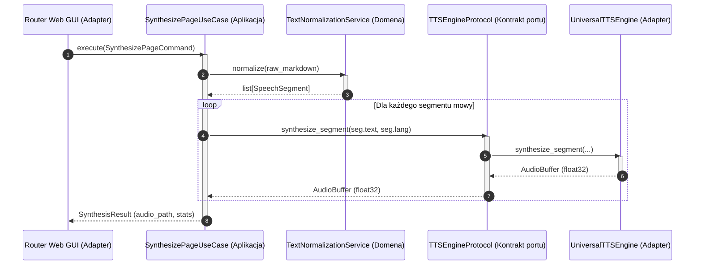

# Granice warstw i kontrakty danych

## Przegląd

Komunikacja na granicach warstw w architekturze Lektor Pro opiera się na rozłącznych kontraktach danych oraz interfejsach typowania strukturalnego (`typing.Protocol`).

## Klasyfikacja kontraktów danych

### 1. Kontrakty wejściowe: komendy i zapytania (DTO)

Warstwa aplikacji przyjmuje wyłącznie niezmienne struktury danych (`frozen=True`). Adaptery interfejsów tłumaczą żądania HTTP lub parametry konsoli na obiekty komend:

* `SynthesizePageCommand`: Zawiera ścieżkę do pliku Markdown, docelowy folder wyjściowy audio, format oraz flagi pomijania istniejących nagrań.
* `StartConversionCommand`: Przekazuje ścieżkę do źródłowego pliku PDF, identyfikator książki (`slug`), rozdzielczość DPI i zakres stron.
* `PreviewPageQuery`: Definiuje zapytanie o podgląd podziału tekstu na segmenty bez uruchamiania generowania dźwięku.

### 2. Kontrakty wyjściowe: porty aplikacji (protokoły)

Przypadki użycia nie wywołują bezpośrednio operacji na plikach ani sterownikach sprzętowych. Zamiast tego komunikują się z protokołami zdefiniowanymi w `lektor.application.ports`:

* `TTSEngineProtocol`: Wymaga metod `load_model()`, `unload_model()`, `synthesize_segment()` oraz `is_loaded()`.
* `BookRepositoryProtocol`: Definiuje operacje odczytu, tworzenia i aktualizacji metadanych w magazynie książek.
* `AIModelArbiterProtocol`: Steruje dostępem do akceleratora graficznego bez ujawniania szczegółów sterownika CUDA.

### 3. Izolacja granic danych

Dane zwracane z przypadków użycia do adapterów mają formę niemutowalnych obiektów domenowych lub dedykowanych struktur wynikowych (`SynthesisResult`, `SynthesisStats`, `BookMetadataDTO`). Routery FastAPI dokonują ich serializacji do modeli Pydantic przed odesłaniem odpowiedzi do przeglądarki.
