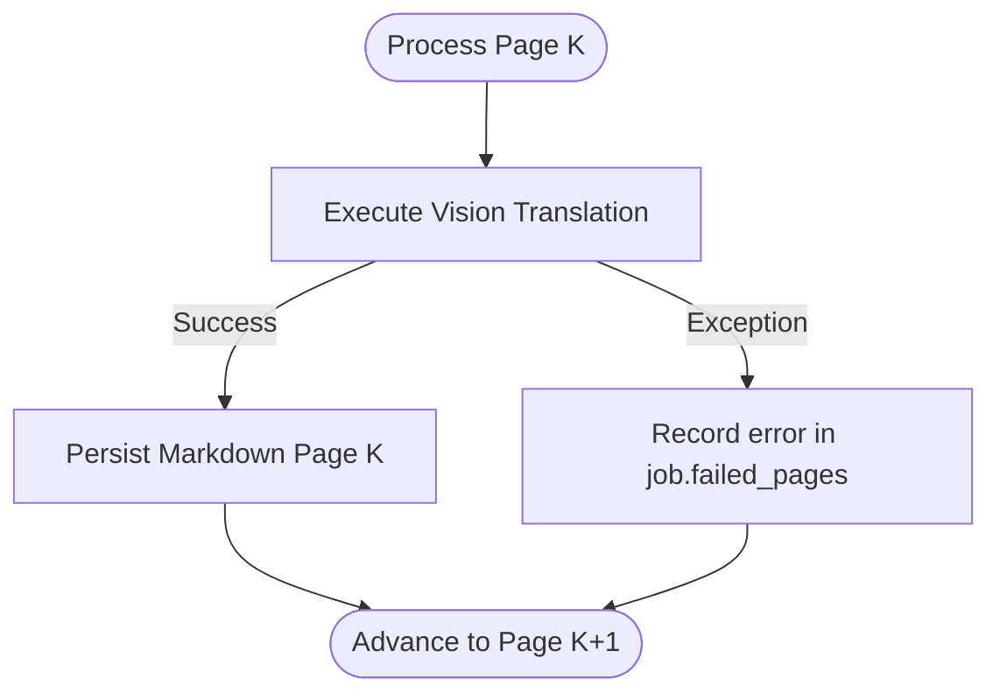

# Business rules: conversion pipeline resilience (BR-011 to BR-015)

## Overview

These business rules define fault tolerance, rendering constraints, and live telemetry requirements for PDF book conversion workflows.

---

### BR-011: Publishing resolution for scan bitmaps

- **Statement**: When splitting source PDF books into raster images, the engine must render pages at 300 DPI ($\text{dots per inch}$).
- **Invariant**: Rendered images must preserve full legibility for code listings, small mono fonts, and diagram labels to prevent multimodal recognition degradation.
- **Calculation**: Standard PDF resolution is $72\text{ DPI}$. The zoom matrix scale is:
  $$\text{zoom} = \frac{300}{72} \approx 4.1667$$
- **Enforcement**: Handled by `PyMuPdfSplitterAdapter` in `lektor.adapters.ocr.pdf_splitter`.

---

### BR-012: Diagram transcription to Mermaid.js syntax

- **Statement**: All structural figures, flowcharts, and system architecture sketches found on book pages must be transcribed into valid Mermaid diagrams.
- **Invariant**:
  - The diagram block must begin with an approved keyword (`flowchart`, `sequenceDiagram`, `classDiagram`, `stateDiagram-v2`, `erDiagram`, `gantt`).
  - All opening node brackets (`[`, `(`, `{`) must have matching closures.
- **Enforcement**: Verified by `MarkdownPageValidationService.validate_mermaid_syntax`.

---

### BR-013: Resilience against single-page failures

- **Statement**: A failure on an individual page must never terminate the batch conversion pipeline.
- **Invariant**: If an unhandled exception or API timeout occurs on page $K$, the pipeline records the error in `job.failed_pages[K]`, emits an error event, and proceeds to page $K+1$.
- **Enforcement**: Orchestrated in `ConvertPdfBookUseCase.execute`.

---

### BR-014: Real-time telemetry broadcasting

* **Statement**: Every lifecycle event, state transition, and completed page in the conversion workflow must emit an updated telemetry snapshot.
* **Invariant**: The `ConversionTelemetry` payload must provide:
* `progress_pct`: Percentage completed ($0.0 \le P \le 100.0$).
* `tokens_per_sec`: Processing throughput rate.
* `eta_sec`: Remaining duration estimate based on elapsed page time ($\text{remaining\_pages} \times \text{page\_duration\_sec}$).
* `vram_used_mb` & `gpu_utilization_pct`: Real-time GPU status.

* **Enforcement**: Handled by `TelemetryBroadcasterProtocol` via Server-Sent Events (`/api/converter/progress/{task_id}`).

---

### BR-015: Cooperative cancellation responsiveness

* **Statement**: Long-running conversion jobs must check for cooperative cancellation requests between page iterations.
* **Invariant**: When `job.cancellation_requested` is detected, the workflow transitions immediately to `ConversionTaskState.CANCELLED`, stops further API calls, releases model leases, and exits cleanly.
* **Enforcement**: Checked in `ConvertPdfBookUseCase.execute` and `ConsoleProgressReporter.check_cancellation`.
