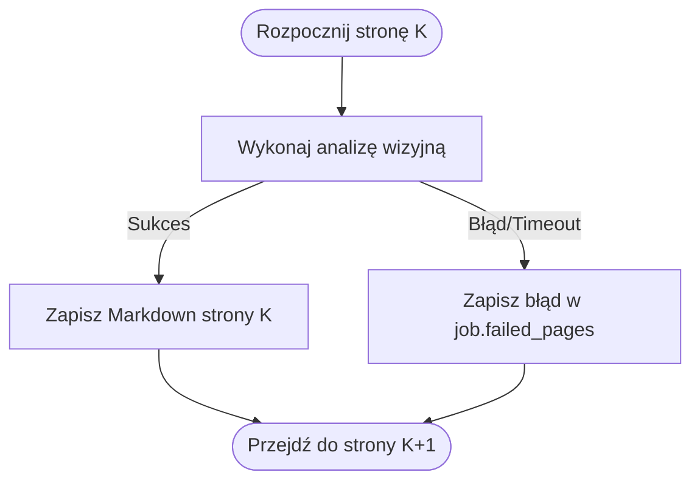

# Reguły biznesowe: odporność potoku konwersji (BR-011 do BR-015)

## Przegląd

Niniejsze reguły określają odporność na błędy, standardy renderowania oraz wymogi telemetrii na żywo podczas konwersji książek z formatu PDF do Markdown.

---

### BR-011: Rozdzielczość wydawnicza skanów stron

- **Treść reguły**: Podczas podziału pliku PDF na obrazy rastrowe silnik musi renderować strony w rozdzielczości 300 DPI ($\text{punktów na cal}$).
- **Niezmiennik**: Wyrenderowany obraz musi gwarantować pełną czytelność drobnego druku, bloków kodu oraz etykiet na diagramach, zapobiegając błędom modelu wizyjnego.
- **Przeliczenie**: Bazowa rozdzielczość PDF wynosi $72\text{ DPI}$. Współczynnik powiększenia wynosi:
  $$\text{zoom} = \frac{300}{72} \approx 4{,}1667$$
- **Egzekwowanie**: Wymuszane przez `PyMuPdfSplitterAdapter` w module `lektor.adapters.ocr.pdf_splitter`.

---

### BR-012: Transkrypcja diagramów do składni Mermaid.js

- **Treść reguły**: Wszystkie schematy blokowe, diagramy przepływu oraz rysunki architektoniczne ze skanów muszą zostać przekształcone w poprawne bloki Mermaid.
- **Niezmiennik**:
  - Blok diagramu musi rozpoczynać się od dopuszczalnego słowa kluczowego (`flowchart`, `sequenceDiagram`, `classDiagram`, `stateDiagram-v2`, `erDiagram`, `gantt`).
  - Wszystkie nawiasy węzłów (`[`, `(`, `{`) muszą być poprawnie domknięte.
- **Egzekwowanie**: Sprawdzane przez `MarkdownPageValidationService.validate_mermaid_syntax`.

---

### BR-013: Odporność na awarie pojedynczych stron

- **Treść reguły**: Wystąpienie błędu na pojedynczej stronie nie może przerywać całego zadania konwersji wsadowej.
- **Niezmiennik**: W przypadku wyjątku lub przekroczenia limitu czasu na stronie $K$, błąd jest odnotowywany w słowniku `job.failed_pages[K]`, system emituje telemetrię błędu, po czym przechodzi do strony $K+1$.
- **Egzekwowanie**: Realizowane w metodzie `ConvertPdfBookUseCase.execute`.

---

### BR-014: Emisja telemetrii w czasie rzeczywistym

* **Treść reguły**: Każda zmiana stanu zadania oraz ukończenie przetwarzania strony musi emitować aktualny stan telemetrii.
* **Niezmiennik**: Obiekt `ConversionTelemetry` musi przekazywać:
* `progress_pct`: Procent ukończenia ($0{,}0 \le P \le 100{,}0$).
* `tokens_per_sec`: Prędkość generowania tokenów.
* `eta_sec`: Szacowany czas do zakończenia ($\text{pozostałe\_strony} \times \text{czas\_trwania\_strony}$).
* `vram_used_mb` oraz `gpu_utilization_pct`: Aktualne obciążenie akceleratora graficznego.

* **Egzekwowanie**: Realizowane przez `TelemetryBroadcasterProtocol` za pośrednictwem Server-Sent Events (`/api/converter/progress/{task_id}`).

---

### BR-015: Kooperacyjna reakcja na sygnał anulowania

* **Treść reguły**: Długotrwałe zadania konwersji muszą weryfikować żądanie zatrzymania pomiędzy przetwarzaniem kolejnych stron.
* **Niezmiennik**: Po wykryciu flagi `job.cancellation_requested` zadanie natychmiast przechodzi w stan `ConversionTaskState.CANCELLED`, przerywa wywołania API, zwalnia zasoby i bezpiecznie kończy pracę.
* **Egzekwowanie**: Sprawdzane w `ConvertPdfBookUseCase.execute` oraz `ConsoleProgressReporter.check_cancellation`.
