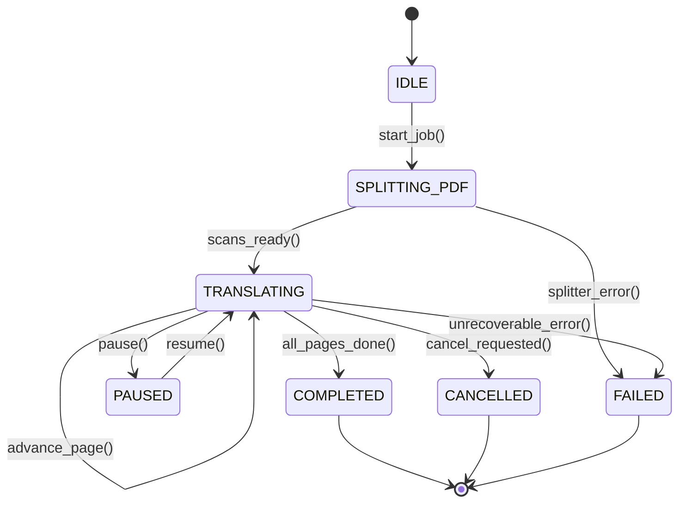

# Conversion lifecycle & state machine

## Overview

The document conversion workflow is governed by an explicit finite state machine. It prevents invalid state transitions during multimodal vision translation, tracks progress, and emits telemetry.

---

## 1. Lifecycle states

Defined in `lektor.domain.conversion_models.ConversionTaskState`:

```python
class ConversionTaskState(str, Enum):
    IDLE = "IDLE"
    SPLITTING_PDF = "SPLITTING_PDF"
    TRANSLATING = "TRANSLATING"
    PAUSED = "PAUSED"
    COMPLETED = "COMPLETED"
    CANCELLED = "CANCELLED"
    FAILED = "FAILED"

```

---

## 2. State transition diagram



### Terminal states

* **`COMPLETED`**: All target pages rendered, translated, validated, and saved to disk.
* **`CANCELLED`**: Execution cooperatively aborted by the user between page iterations.
* **`FAILED`**: Catastrophic failure occurred (e.g., missing PDF file or unrecoverable model crash).

---

## 3. The `ConversionJob` entity

Encapsulates mutable lifecycle state for an active translation job:

```python
@dataclass
class ConversionJob:
    task_id: ConversionTaskId
    book_slug: BookSlug
    pdf_path: Path
    state: ConversionTaskState = ConversionTaskState.IDLE
    current_page: int = 0
    total_pages: int = 0
    failed_pages: dict[int, str] = field(default_factory=dict)
    cancellation_requested: bool = False

    def request_cancellation(self) -> None:
        self.cancellation_requested = True

    def is_terminal(self) -> bool:
        return self.state in {
            ConversionTaskState.COMPLETED,
            ConversionTaskState.CANCELLED,
            ConversionTaskState.FAILED,
        }

```

---

## 4. Telemetry snapshot: `ConversionTelemetry`

Immutable value object broadcasted over Server-Sent Events (SSE) on state transitions:

```python
@dataclass(frozen=True)
class ConversionTelemetry:
    task_id: ConversionTaskId
    book_slug: BookSlug
    state: ConversionTaskState
    current_page: int
    total_pages: int
    progress_pct: float
    elapsed_sec: float
    page_duration_sec: float
    tokens_per_sec: float
    eta_sec: float
    vram_used_mb: float
    vram_total_mb: float
    gpu_utilization_pct: float
    current_step_description: str
    error_message: str | None = None

```