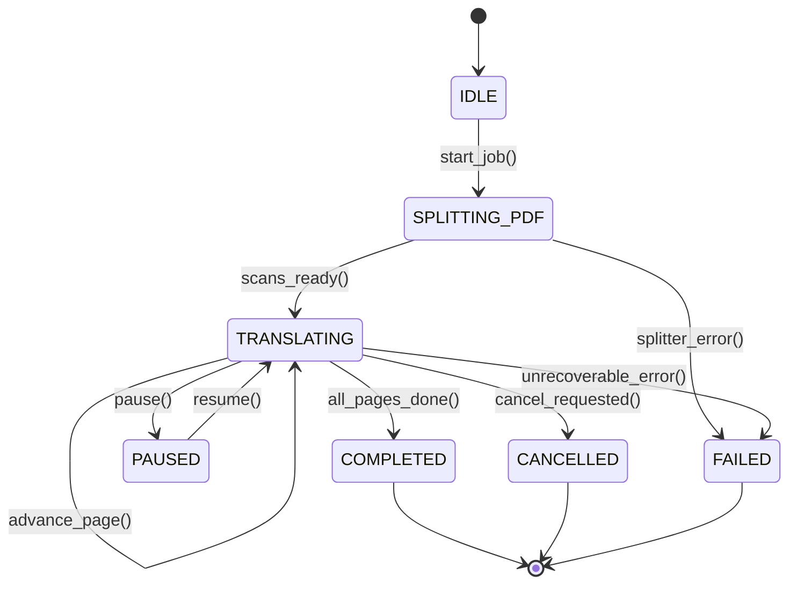

# Maszyna stanów cyklu życia konwersji

## Przegląd

Proces konwersji dokumentów PDF na Markdown jest zarządzany przez skończoną maszynę stanów. Zapobiega ona niepoprawnym przejściom podczas analizy wizyjnej, rejestruje postęp i emituje telemetrię na żywo.

---

## 1. Stany cyklu życia

Zdefiniowane w `lektor.domain.conversion_models.ConversionTaskState`:

```python
class ConversionTaskState(str, Enum):
    IDLE = "IDLE"
    SPLITTING_PDF = "SPLITTING_PDF"
    TRANSLATING = "TRANSLATING"
    PAUSED = "PAUSED"
    COMPLETED = "COMPLETED"
    CANCELLED = "CANCELLED"
    FAILED = "FAILED"

```

---

## 2. Diagram przejść maszyny stanów



### Stany końcowe (terminalne)

* **`COMPLETED`**: Wszystkie zaplanowane strony zostały wyrenderowane, przetłumaczone, zwalidowane i zapisane na dysku.
* **`CANCELLED`**: Przetwarzanie zostało kooperacyjnie przerwane na żądanie użytkownika między stronami.
* **`FAILED`**: Wystąpił krytyczny błąd uniemożliwiający dalszą pracę (np. brak pliku PDF lub awaria serwera modelu).

---

## 3. Encja `ConversionJob`

Reprezentuje bieżący stan wykonywanego zadania konwersji:

```python
@dataclass
class ConversionJob:
    task_id: ConversionTaskId
    book_slug: BookSlug
    pdf_path: Path
    state: ConversionTaskState = ConversionTaskState.IDLE
    current_page: int = 0
    total_pages: int = 0
    failed_pages: dict[int, str] = field(default_factory=dict)
    cancellation_requested: bool = False

    def request_cancellation(self) -> None:
        self.cancellation_requested = True

    def is_terminal(self) -> bool:
        return self.state in {
            ConversionTaskState.COMPLETED,
            ConversionTaskState.CANCELLED,
            ConversionTaskState.FAILED,
        }

```

---

## 4. Migawka telemetrii: `ConversionTelemetry`

Niezmienny obiekt wartości przesyłany strumieniowo przez Server-Sent Events (SSE) przy każdej zmianie stanu:

```python
@dataclass(frozen=True)
class ConversionTelemetry:
    task_id: ConversionTaskId
    book_slug: BookSlug
    state: ConversionTaskState
    current_page: int
    total_pages: int
    progress_pct: float
    elapsed_sec: float
    page_duration_sec: float
    tokens_per_sec: float
    eta_sec: float
    vram_used_mb: float
    vram_total_mb: float
    gpu_utilization_pct: float
    current_step_description: str
    error_message: str | None = None

```