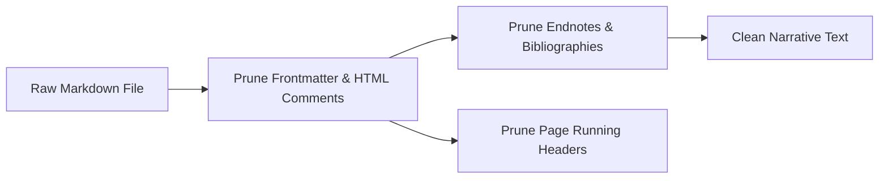

# Markdown stripping rules

## Overview

This document specifies the rules for stripping typography, document artifacts, and non-spoken Markdown structures prior to audio synthesis. Implemented in `lektor.domain.normalizers.markdown`, these transformations ensure the neural vocoder receives only speech-ready text.

---

## 1. Document-level pruning

The `clean_markdown_document` function prunes visual metadata and bibliography elements across the entire document:

### Pruning invariants

1. **HTML Comments**: Pruned via multiline regular expression `<!--[\s\S]*?-->`.
2. **YAML Frontmatter**: Removed if present at file start (`^---\n[\s\S]*?\n---\n`).
3. **Endnotes & Footnotes**:
* Footnote definitions (`[^1]: ...`) and indented continuation lines are removed.
* Inline citation tags (`[^1]`, `[^42]`) are stripped from sentences.
* Entire chapters titled `Przypisy końcowe` are discarded up to the next main section.

4. **Scan Footers & Images**:
* Markdown image references `` and scan captions (`*Oryginalny skan strony:*`) are pruned.
* Running page headers (`# Strona 052 — Tytuł...`) are removed to avoid repetitive titles.

---

## 2. Paragraph-level structural normalization

The `clean_markdown_structure` function strips typography formatting within individual paragraphs:

| Markdown syntax | Action | Rationale |
| --- | --- | --- |
| `---`, `***` | Removed entirely | Horizontal rules produce vocoder clicking artifacts |
| `**text**`, `*text*` | Unwrapped to `text` | Bold/italic markers are visual-only emphasis |
| `#`, `##`, `###` | Stripped from start | Headings are converted to speech segments with pauses |
| `—`, `–` | Replaced with `, ` | Em/en dashes are transformed into grammatical breath pauses |
| `...`, `…` | Trimmed at boundaries | Trailing ellipses cause model mumbling and pitch drops |
| `> blockquote` | Prefix `>` stripped | Quotes are flattened into spoken narration |
| `- item`, `* item` | Bullet markers stripped | List items become continuous sequential segments |

---

## 3. Title extraction fallback

The `extract_markdown_title` utility determines the canonical title of a page:

1. Searches for the first top-level heading (`# Heading`).
2. Trims prefixes such as `Strona 042 — `.
3. If no heading exists, falls back to the first sentence (capped at 50 characters) or defaults to the sanitized file stem.
