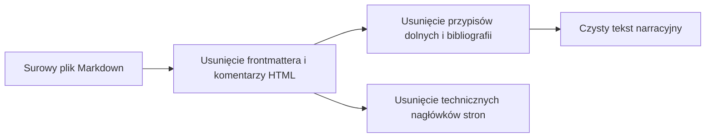

# Reguły czyszczenia składni Markdown

## Przegląd

Dokument określa zasady usuwania elementów typograficznych, metadanych oraz struktur Markdown nieprzeznaczonych do odczytu głosowego. Zaimplementowane w module `lektor.domain.normalizers.markdown`, reguły te gwarantują, że silnik TTS otrzymuje wyłącznie czysty tekst narracyjny.

---

## 1. Czyszczenie na poziomie całego dokumentu

Funkcja `clean_markdown_document` usuwa metadane wizualne oraz sekcje bibliograficzne z całego pliku:

### Niezmienniki usuwania struktur

1. **Komentarze HTML**: Usuwane za pomocą wielowierszowego wyrażenia regularnego `<!--[\s\S]*?-->`.
2. **Frontmatter YAML**: Odcinany, jeśli występuje na początku pliku (`^---\n[\s\S]*?\n---\n`).
3. **Przypisy dolne i końcowe**:
* Definicje przypisów (`[^1]: ...`) wraz z wciętymi liniami kontynuacji są usuwane w całości.
* Odsyłacze wewnątrz zdań (`[^1]`, `[^42]`) są wycinane z tekstu narracji.
* Całe sekcje o tytule `Przypisy końcowe` są odrzucane aż do kolejnego głównego nagłówka.

4. **Stopki skanów i ilustracje**:
* Znaczniki obrazów `` oraz etykiety skanów (`*Oryginalny skan strony:*`) są usuwane.
* Nagłówki biegowe stron (`# Strona 052 — Tytuł...`) są odcinane, aby zapobiec powtarzaniu numeracji.

---

## 2. Normalizacja struktury na poziomie akapitu

Funkcja `clean_markdown_structure` usuwa znaczniki formatowania w obrębie pojedynczych akapitów:

| Składnia Markdown | Zastosowane działanie | Uzasadnienie inżynierskie |
| --- | --- | --- |
| `---`, `***` | Całkowicie usuwane | Poziome linie powodują trzaski i błędy vocodera |
| `**tekst**`, `*tekst*` | Zastępowane przez `tekst` | Pogrubienie i kursywa to wyróżnienia wyłącznie wzrokowe |
| `#`, `##`, `###` | Usuwane z początku linii | Nagłówki stają się segmentami z dłuższą pauzą lektorską |
| `—`, `–` | Zamieniane na `, ` | Myślniki i pauzy są przekształcane w naturalne pauzy oddechowe |
| `...`, `…` | Odcinane na krawędziach | Wielokropki powodują spadek wysokości głosu i mruczenie |
| `> cytat` | Znacznik `>` usuwany | Cytaty są czytane jako płynna treść narracyjna |
| `- punkt`, `* punkt` | Punktory listy usuwane | Elementy listy stają się sekwencyjnymi zdaniami |

---

## 3. Ekstrakcja tytułu strony

Funkcja pomocnicza `extract_markdown_title` wyznacza kanoniczny tytuł strony:

1. Wyszukuje pierwszy nagłówek pierwszego poziomu (`# Nagłówek`).
2. Odcina prefiksy techniczne, np. `Strona 042 — `.
3. W przypadku braku nagłówka przyjmuje pierwsze zdanie (do 50 znaków) lub nazwę pliku z usuniętym rozszerzeniem.
