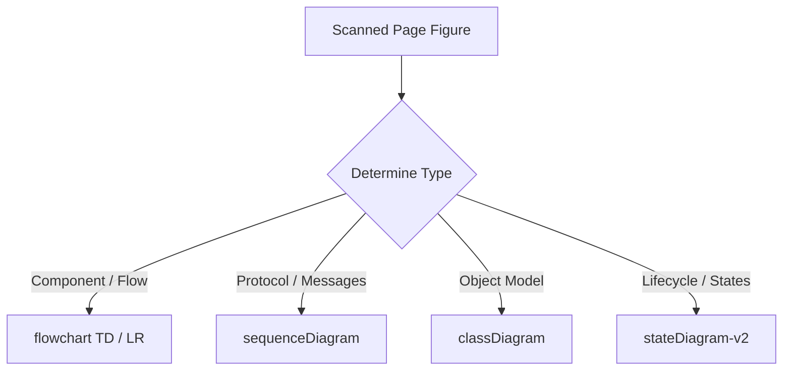

# Mermaid.js syntax contract

## Overview

This contract governs the transcription of visual architecture figures, sequence diagrams, and flowcharts into valid Mermaid.js notation during book conversion.

---

## 1. Supported diagram archetypes

Only standard Mermaid diagram formats are accepted in generated pages:



### Approved header keywords

* `flowchart TD`, `flowchart LR`, `graph TD`, `graph LR`
* `sequenceDiagram`
* `classDiagram`
* `stateDiagram-v2`
* `erDiagram`
* `gantt`

---

## 2. Syntactic invariants and bracket balancing

The `validate_mermaid_syntax` function validates each ````mermaid` code block:

1. **Header validation**: The first non-empty line of the block must match one of the approved keywords.
2. **Bracket balancing**: All node shapes must have matched opening and closing characters:
* Rectangles: `[` and `]`
* Rounded boxes: `(` and `)`
* Decisions / Diamonds: `{` and `}`
* Subroutine shapes: `[[` and `]]`
* Cylinders (Databases): `[(` and `)]`


3. **Forbidden characters**: Node labels must not contain unescaped quotation marks (`"`) or raw pipe delimiters (`|`), which break the parser.

---

## 3. Repair procedures

If an extracted diagram contains syntax errors, the pipeline attempts fallback repairs:

* Appending missing closing brackets based on a balance counter.
* Converting invalid edge arrows (e.g. `-- ->`) to valid connectors (`-->`).
* If syntax remains invalid after repair passes, the diagram block is converted to a preformatted code block (````text`) with an issue flag, preventing site rendering breakage.
