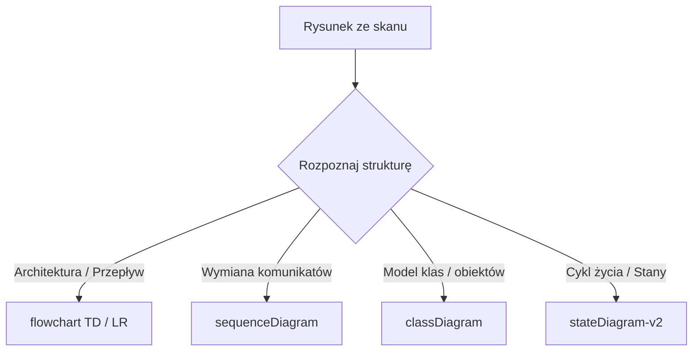

```markdown
# Kontrakt składni diagramów Mermaid.js

## Przegląd

Kontrakt określa reguły transkrypcji rysunków architektonicznych, diagramów sekwencji oraz schematów blokowych ze skanów książek na poprawny format Mermaid.js.

---

## 1. Obsługiwane typy diagramów

W generowanych stronach dopuszczalne są wyłącznie standardowe typy diagramów:



### Dozwolone nagłówki bloków

* `flowchart TD`, `flowchart LR`, `graph TD`, `graph LR`
* `sequenceDiagram`
* `classDiagram`
* `stateDiagram-v2`
* `erDiagram`
* `gantt`

---

## 2. Niezmienniki składniowe i domykanie nawiasów

Funkcja `validate_mermaid_syntax` sprawdza każdy blok ````mermaid` pod kątem poprawności:

1. **Weryfikacja nagłówka**: Pierwsza niepusta linia bloku musi zawierać jedno z dozwolonych słów kluczowych.
2. **Balans nawiasów węzłów**: Wszystkie kształty węzłów muszą mieć sparowane znaki otwierające i zamykające:
* Prostokąty: `[` oraz `]`
* Zaokrąglone ramki: `(` oraz `)`
* Węzły decyzyjne (romby): `{` oraz `}`
* Podprogramy: `[[` oraz `]]`
* Bazy danych (cylindry): `[(` oraz `)]`


3. **Znaki zastrzeżone**: Etykiety węzłów nie mogą zawierać niesparowanych cudzysłowów (`"`) ani wolnych znaków pionowej kreski (`|`), które zaburzają parsowanie połączeń.

---

## 3. Procedury naprawcze

W przypadku wykrycia błędów w wygenerowanym diagramie potok uruchamia mechanizm naprawczy:

* Automatyczne domykanie brakujących nawiasów na podstawie licznika otwarć.
* Korekta uszkodzonych strzałek połączeń (np. zamiana `-- ->` na `-->`).
* Jeśli diagram pozostaje niepoprawny po próbie naprawy, blok zostaje oznaczony jako surowy tekst (````text`), co zapobiega awarii parsera w przeglądarce i umożliwia ręczną korektę.
