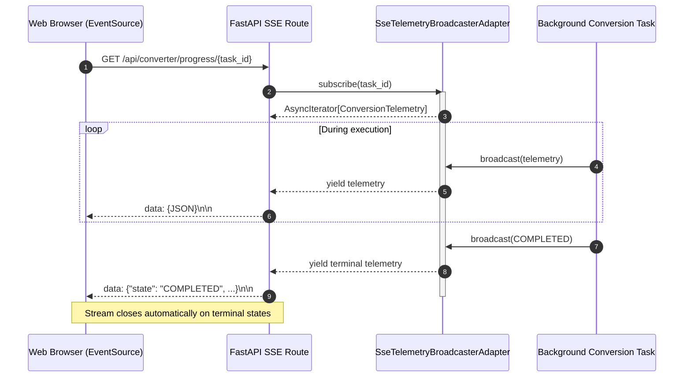

# Server-Sent Events (SSE) telemetry protocol

## Overview

This specification details the live event-streaming protocol over Server-Sent Events (SSE) for document vision translation, scan rendering, and hardware telemetry. Defined in `lektor.adapters.gui.broadcaster` and exposed via `/api/converter/progress/{task_id}` and `/api/converter/render-scans-stream`.

---

## 1. Transport specification

- **Content-Type**: `text/event-stream`
- **Cache-Control**: `no-cache`
- **Connection**: `keep-alive`
- **X-Accel-Buffering**: `no` (prevents intermediate reverse-proxy stream buffering)

Each packet follows standard SSE protocol formatting:
```text
data: {"task_id": "...", "state": "TRANSLATING", ...}\n\n

```

---

## 2. Event stream architecture



---

## 3. Telemetry event payload schema

Broadcasted JSON payload conforms to `ConversionTelemetry`:

| Key | Type | Description |
| --- | --- | --- |
| `task_id` | `string` | Unique conversion identifier (UUIDv4) |
| `book_slug` | `string` | Target book directory slug |
| `state` | `string` | `IDLE`, `SPLITTING_PDF`, `TRANSLATING`, `PAUSED`, `COMPLETED`, `CANCELLED`, `FAILED` |
| `current_page` | `integer` | 1-based index of current page |
| `total_pages` | `integer` | Total number of pages in conversion scope |
| `progress_pct` | `float` | Completion percentage rounded to 1 decimal place |
| `elapsed_sec` | `float` | Total elapsed seconds since task started |
| `page_duration_sec` | `float` | Duration required to process the most recent page |
| `tokens_per_sec` | `float` | Generation throughput reported by LLM/VLM client |
| `eta_sec` | `float` | Estimated time to finish remaining pages |
| `vram_used_mb` | `float` | Real-time memory consumption queried from `nvidia-smi` |
| `vram_total_mb` | `float` | Total physical VRAM capacity of graphics card |
| `gpu_utilization_pct` | `float` | Hardware compute core utilization percentage |
| `current_step_description` | `string` | Human-readable log entry for UI console |
| `error_message` | `string | null` |

---

## 4. Connection lifecycle & subscriber management

* **Queue boundaries**: Each active subscriber receives a dedicated `asyncio.Queue(maxsize=100)`. If a client falls behind, older events are dropped using `put_nowait` to avoid blocking worker threads.
* **Immediate state delivery**: Upon subscribing, the broadcaster immediately yields the most recent telemetry snapshot if available.
* **Terminal disconnect**: When `state` reaches `COMPLETED`, `CANCELLED`, or `FAILED`, the event loop terminates the generator and releases subscriber resources.
