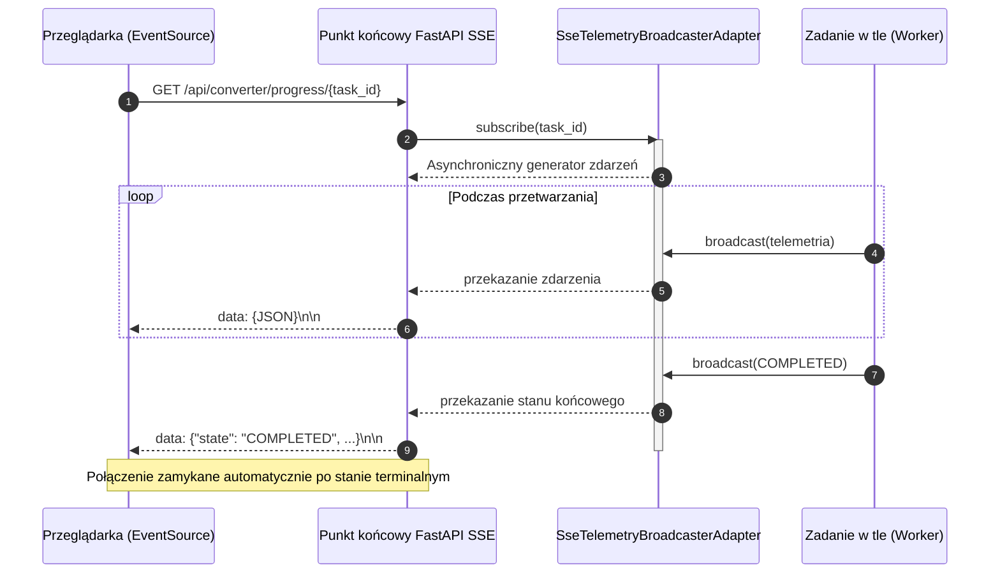

# Protokół strumieniowania telemetrii Server-Sent Events (SSE)

## Przegląd

Dokument określa protokół przesyłania telemetrii czasu rzeczywistego za pośrednictwem mechanizmu Server-Sent Events (SSE) dla procesów analizy wizyjnej, renderowania skanów oraz monitorowania obciążenia sprzętu. Zaimplementowany w module `lektor.adapters.gui.broadcaster` i udostępniany w punktach końcowych `/api/converter/progress/{task_id}` oraz `/api/converter/render-scans-stream`.

---

## 1. Standard transmisji HTTP

- **Content-Type**: `text/event-stream`
- **Cache-Control**: `no-cache`
- **Connection**: `keep-alive`
- **X-Accel-Buffering**: `no` (wyłącza buforowanie strumienia po stronie serwerów pośredniczących)

Każda ramka jest przesyłana zgodnie ze standardem SSE:
```text
data: {"task_id": "...", "state": "TRANSLATING", ...}\n\n

```

---

## 2. Architektura strumieniowania zdarzeń



---

## 3. Struktura danych telemetrycznych

Rozgłaszany obiekt JSON odpowiada klasie `ConversionTelemetry`:

| Pole | Typ | Opis |
| --- | --- | --- |
| `task_id` | `string` | Unikalny identyfikator zadania (UUIDv4) |
| `book_slug` | `string` | Identyfikator katalogu książki |
| `state` | `string` | `IDLE`, `SPLITTING_PDF`, `TRANSLATING`, `PAUSED`, `COMPLETED`, `CANCELLED`, `FAILED` |
| `current_page` | `integer` | Numer bieżącej strony liczony od 1 |
| `total_pages` | `integer` | Łączna liczba stron w zadaniu |
| `progress_pct` | `float` | Procent ukończenia zaokrąglony do jednego miejsca po przecinku |
| `elapsed_sec` | `float` | Czas trwania zadania w sekundach od momentu uruchomienia |
| `page_duration_sec` | `float` | Czas potrzebny na przetworzenie ostatniej strony |
| `tokens_per_sec` | `float` | Prędkość generowania tokenów przez model wizyjny |
| `eta_sec` | `float` | Szacowany czas do zakończenia przetwarzania pozostałych stron |
| `vram_used_mb` | `float` | Zużycie pamięci karty graficznej odczytane z `nvidia-smi` |
| `vram_total_mb` | `float` | Całkowita fizyczna pamięć VRAM karty graficznej |
| `gpu_utilization_pct` | `float` | Procentowe obciążenie rdzeni obliczeniowych karty graficznej |
| `current_step_description` | `string` | Czytelny komunikat tekstowy do konsoli interfejsu |
| `error_message` | `string | null` |

---

## 4. Cykl życia połączenia i obsługa subskrypcji

* **Ograniczenie kolejki**: Każdy klient otrzymuje dedykowaną kolejkę `asyncio.Queue(maxsize=100)`. W przypadku wolnego łącza starsze zdarzenia są odrzucane (`put_nowait`), co zapobiega blokowaniu wątków roboczych.
* **Natychmiastowe dostarczenie stanu**: Po podłączeniu klient od razu otrzymuje ostatnią znaną migawkę telemetrii.
* **Automatyczne zamykanie**: Gdy stan osiąga wartość `COMPLETED`, `CANCELLED` lub `FAILED`, pętla kończy generator asynchroniczny i zwalnia zasoby subskrybenta.
