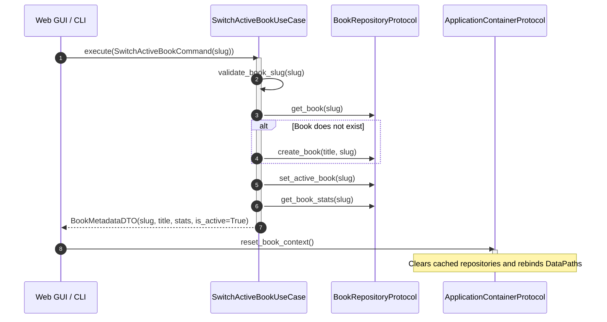

# Use case: book context switching

## Overview

The `SwitchActiveBookUseCase` orchestrates dynamic context switching between technical books at runtime without process restarts. Implemented in `lektor.application.use_cases.switch_active_book`, this interactor enforces directory resolution and triggers cache invalidation in the IoC container.

---

## 1. Interactor architecture & dependencies



---

## 2. Inbound and outbound contracts

### Inbound command: `SwitchActiveBookCommand`

```python
@dataclass(frozen=True)
class SwitchActiveBookCommand:
    slug: BookSlug

```

### Outbound DTO: `BookMetadataDTO`

```python
@dataclass(frozen=True)
class BookMetadataDTO:
    slug: str
    title: str
    total_pages: int
    audio_pages: int
    scan_pages: int
    is_active: bool

```

---

## 3. Workflow invariants

1. **Slug validation**: Input string is strictly validated against `[a-z0-9_]` (`BR-001`). Invalid characters raise a `ValueError`.
2. **Auto-provisioning**: If a requested book is not yet registered in the repository, the use case auto-provisions a canonical workspace tree (`BR-002`).
3. **Marker persistence**: The active slug is written to `data/books/.active` ensuring state survives subsequent launches.
4. **Container invalidation**: The caller triggers `container.reset_book_context()` immediately after execution to purge cached repository handles.
