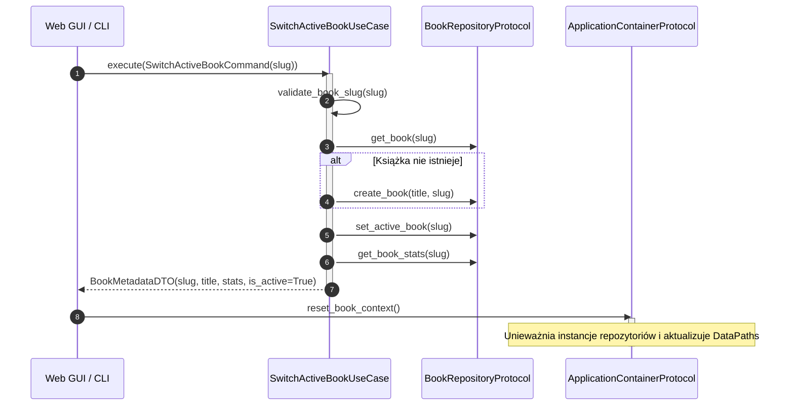

# Przypadek użycia: przełączanie kontekstu książki

## Przegląd

Przypadek użycia `SwitchActiveBookUseCase` odpowiada za dynamiczne przełączanie aktywnej książki w pamięci aplikacji bez konieczności restartu procesu. Zaimplementowany w module `lektor.application.use_cases.switch_active_book`, interaktor ten weryfikuje strukturę katalogów i wymusza unieważnienie pamięci podręcznej w kontenerze zależności.

---

## 1. Architektura interaktora i przepływ sterowania



---

## 2. Kontrakty danych wejściowych i wyjściowych

### Komenda wejściowa: `SwitchActiveBookCommand`

```python
@dataclass(frozen=True)
class SwitchActiveBookCommand:
    slug: BookSlug

```

### Wynikowy obiekt transferu danych: `BookMetadataDTO`

```python
@dataclass(frozen=True)
class BookMetadataDTO:
    slug: str
    title: str
    total_pages: int
    audio_pages: int
    scan_pages: int
    is_active: bool

```

---

## 3. Niezmienniki przypadku użycia

1. **Walidacja identyfikatora**: Identyfikator książki jest rygorystycznie sprawdzany pod kątem dopuszczalnych znaków `[a-z0-9_]` (`BR-001`). Niedozwolone znaki wywołują wyjątek `ValueError`.
2. **Automatyczne tworzenie katalogu**: Jeśli wskazana książka nie istnieje jeszcze w rejestrze, przypadek użycia tworzy dla niej kanoniczną strukturę podkatalogów (`BR-002`).
3. **Zapis znacznika aktywacji**: Wybrany identyfikator jest zapisywany w pliku `data/books/.active`, co zapewnia trwałość wyboru między uruchomieniami.
4. **Czyszczenie kontenera**: Bezpośrednio po wykonaniu komendy wywoływana jest metoda `container.reset_book_context()`, co unieważnia stare referencje do repozytoriów stron i notatek.
