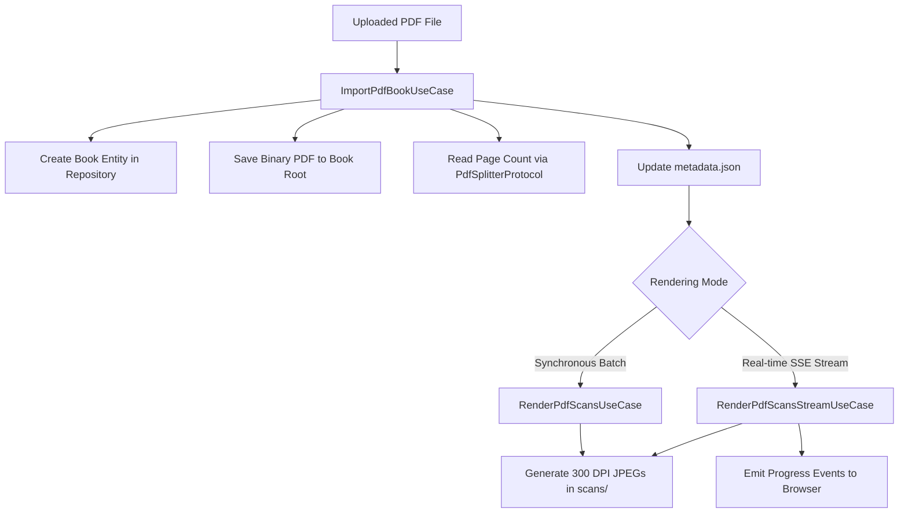

# Use case: PDF import and splitting

## Overview

The PDF import and splitting workflows handle document intake and rasterization. Coordinated by `ImportPdfBookUseCase` (`lektor.application.use_cases.import_pdf_book`), `RenderPdfScansUseCase`, and `RenderPdfScansStreamUseCase`, these interactors prepare pages for vision processing.

---

## 1. Workflows decomposition



---

## 2. Inbound and outbound contracts

### Commands and results

```python
@dataclass(frozen=True)
class ImportPdfBookCommand:
    file_bytes: bytes
    filename: str
    title: Optional[str] = None
    author: Optional[str] = None
    slug: Optional[str] = None

@dataclass(frozen=True)
class ImportPdfBookResult:
    book: Book
    pdf_path: Path
    total_pages: int

@dataclass(frozen=True)
class RenderScansCommand:
    book_slug: str
    dpi: int = 300
    start_page: Optional[int] = None
    end_page: Optional[int] = None

@dataclass(frozen=True)
class RenderScansStreamCommand:
    book_slug: str
    dpi: int = 300
    start_page: Optional[int] = None
    end_page: Optional[int] = None

```

---

## 3. Streaming rasterization mechanics

In `RenderPdfScansStreamUseCase`, CPU-intensive rasterization is offloaded to background threads using `asyncio.to_thread` to prevent blocking the async web loop:

```python
async def execute_stream(self, cmd: RenderScansStreamCommand) -> AsyncIterator[dict[str, object]]:
    # 1. Resolve book and verify PDF existence
    # 2. Calculate target slice boundaries [start_page, end_page]
    # 3. Yield started event
    for idx in range(start_idx, end_idx):
        file_name, _ = await asyncio.to_thread(_render_page_worker, idx, page_1based)
        yield {
            "status": "rendering",
            "current_page": page_1based,
            "percent": pct,
            "file_name": file_name,
            "eta_sec": eta,
        }
    # 4. Yield completed event

```