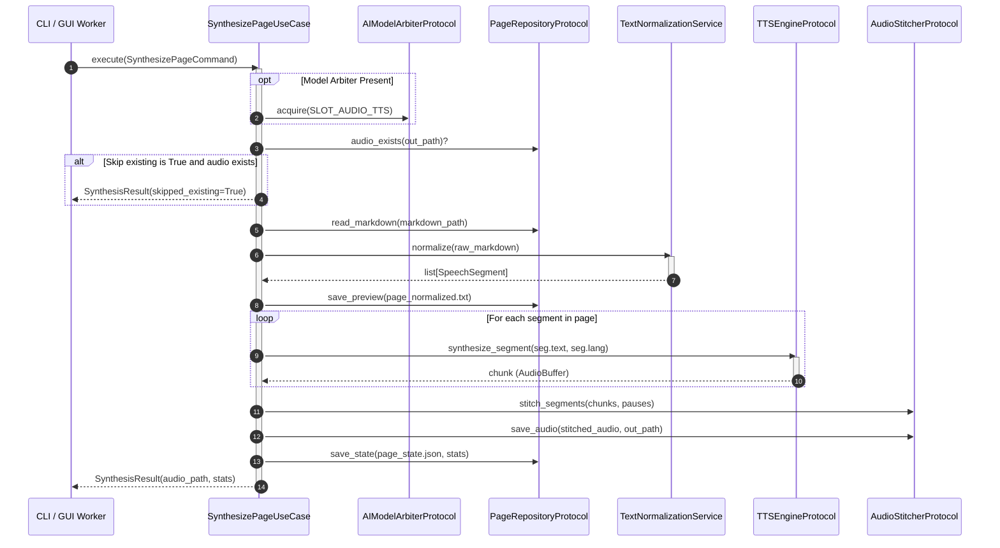

# Use case: speech synthesis (page and batch)

## Overview

These interactors orchestrate neural speech generation from Markdown pages. Managed by `SynthesizePageUseCase` (`lektor.application.use_cases.synthesize_page`) and `BatchSynthesisUseCase` (`lektor.application.use_cases.batch_synthesis`), they convert text structures into concatenated, normalized audio tracks.

---

## 1. Page synthesis execution pipeline



---

## 2. Inbound and outbound contracts

### Commands

```python
@dataclass(frozen=True)
class SynthesizePageCommand:
    markdown_path: Path
    output_dir: Path
    skip_existing: bool = False
    save_normalized_text: bool = True
    audio_format: str = "wav"

@dataclass(frozen=True)
class BatchSynthesisCommand:
    pages_dir: Path
    output_dir: Path
    pattern: str = "page_*.md"
    skip_existing: bool = True
    save_normalized_text: bool = True
    audio_format: str = "wav"

```

---

## 3. Batch coordination and cooperative cancellation

`BatchSynthesisUseCase` iterates through discovered Markdown files sorted numerically. Before processing each page, it queries `progress_reporter.check_cancellation()`. If signaled, it breaks out of the loop cleanly, permitting callers to halt generation without corrupting the file system.
