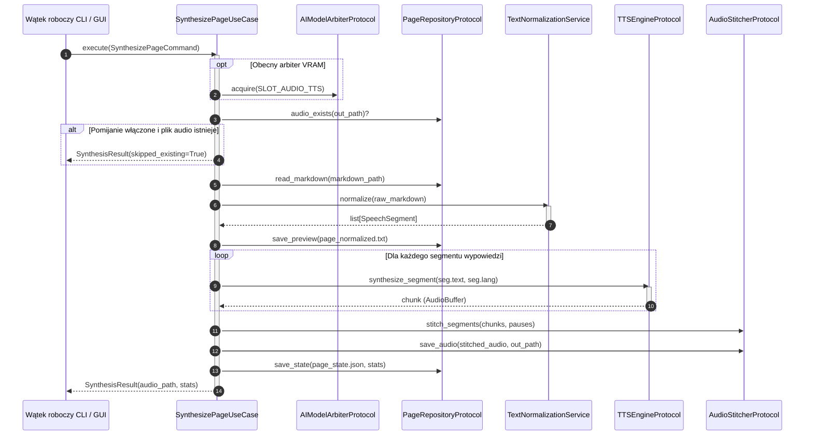

# Przypadek użycia: synteza mowy (pojedyncza strona i przetwarzanie wsadowe)

## Przegląd

Interaktory tej grupy koordynują proces zamiany tekstu Markdown na mowę syntetyczną. Realizowane przez `SynthesizePageUseCase` (`lektor.application.use_cases.synthesize_page`) oraz `BatchSynthesisUseCase` (`lektor.application.use_cases.batch_synthesis`), przekształcają one dokumenty tekstowe w połączone i znormalizowane pliki dźwiękowe.

---

## 1. Potok wykonawczy syntezy pojedynczej strony



---

## 2. Kontrakty danych wejściowych i wyjściowych

### Komendy

```python
@dataclass(frozen=True)
class SynthesizePageCommand:
    markdown_path: Path
    output_dir: Path
    skip_existing: bool = False
    save_normalized_text: bool = True
    audio_format: str = "wav"

@dataclass(frozen=True)
class BatchSynthesisCommand:
    pages_dir: Path
    output_dir: Path
    pattern: str = "page_*.md"
    skip_existing: bool = True
    save_normalized_text: bool = True
    audio_format: str = "wav"

```

---

## 3. Orkiestracja wsadowa i kooperacyjne zatrzymywanie

`BatchSynthesisUseCase` odnajduje pliki stron posortowane numerycznie. Przed rozpoczęciem każdej strony odpytuje metodę `progress_reporter.check_cancellation()`. W przypadku wykrycia sygnału zatrzymania pętla przerywa pracę, co pozwala na bezpieczne zatrzymanie zadania bez uszkadzania stanu plików.
