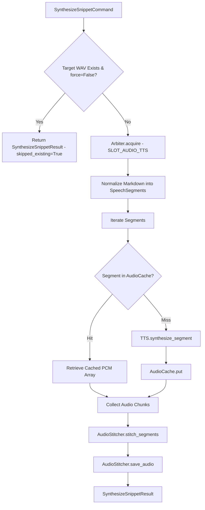

# Use case: studio snippet synthesis

## Overview

The `SynthesizeMarkdownSnippetUseCase` interactor coordinates ad-hoc text-to-speech generation for arbitrary Markdown snippets. Implemented in `lektor.application.use_cases.synthesize_snippet`, it supports real-time rendering in Markdown TTS Studio with content-addressable caching.

---

## 1. Execution flow



---

## 2. Inbound and outbound contracts

### Inbound command: `SynthesizeSnippetCommand`

```python
@dataclass(frozen=True)
class SynthesizeSnippetCommand:
    snippet_id: str
    markdown: str
    output_path: Path
    language_mode: LanguageMode = "bilingual"
    force: bool = False
    voice_path: Optional[Path] = None
    temperature: float = 0.35
    cfg_weight: float = 0.7
    audio_format: str = "wav"

```

### Outbound result: `SynthesizeSnippetResult`

```python
@dataclass(frozen=True)
class SynthesizeSnippetResult:
    snippet_id: str
    audio_path: Path
    duration_sec: float
    file_size_kb: float
    segment_count: int
    normalized_preview: Sequence[str]
    skipped_existing: bool = False

```

---

## 3. Cache mechanics in snippet synthesis

Unlike full page generation, studio snippets benefit from granular segment-level caching:

1. Long texts are split into smaller sentences or phrases.
2. If only one sentence in a paragraph is modified, identical neighboring sentences are resolved instantly from the SHA-256 cache, minimizing GPU compute time.