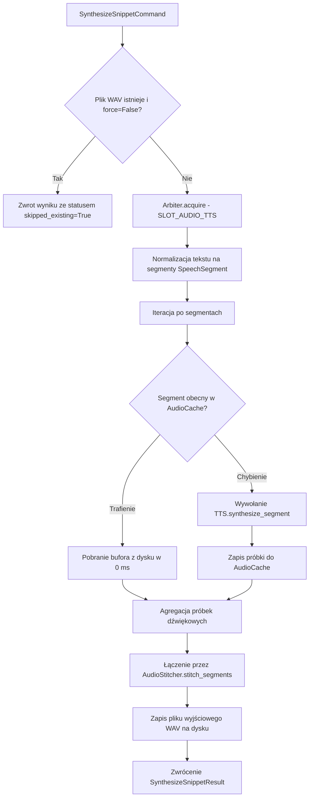

# Przypadek użycia: synteza fragmentu tekstu w studio

## Przegląd

Przypadek użycia `SynthesizeMarkdownSnippetUseCase` odpowiada za generowanie mowy z dowolnych fragmentów tekstu Markdown. Zaimplementowany w module `lektor.application.use_cases.synthesize_snippet`, obsługuje interaktywny pulpit studia nagrań z wykorzystaniem pamięci podręcznej segmentów audio.

---

## 1. Przebieg wykonania



---

## 2. Kontrakty danych wejściowych i wyjściowych

### Komenda wejściowa: `SynthesizeSnippetCommand`

```python
@dataclass(frozen=True)
class SynthesizeSnippetCommand:
    snippet_id: str
    markdown: str
    output_path: Path
    language_mode: LanguageMode = "bilingual"
    force: bool = False
    voice_path: Optional[Path] = None
    temperature: float = 0.35
    cfg_weight: float = 0.7
    audio_format: str = "wav"

```

### Wynik: `SynthesizeSnippetResult`

```python
@dataclass(frozen=True)
class SynthesizeSnippetResult:
    snippet_id: str
    audio_path: Path
    duration_sec: float
    file_size_kb: float
    segment_count: int
    normalized_preview: Sequence[str]
    skipped_existing: bool = False

```

---

## 3. Rola pamięci podręcznej w module studio

W odróżnieniu od syntezy całych stron, studio wykorzystuje granulację na poziomie pojedynczych zdań:

1. Długi tekst jest dzielony na niezależne wypowiedzi.
2. Przy edycji pojedynczego słowa w akapicie, niezmienione zdania są ładowane natychmiast z pamięci podręcznej SHA-256, oszczędzając czas pracy karty graficznej.
