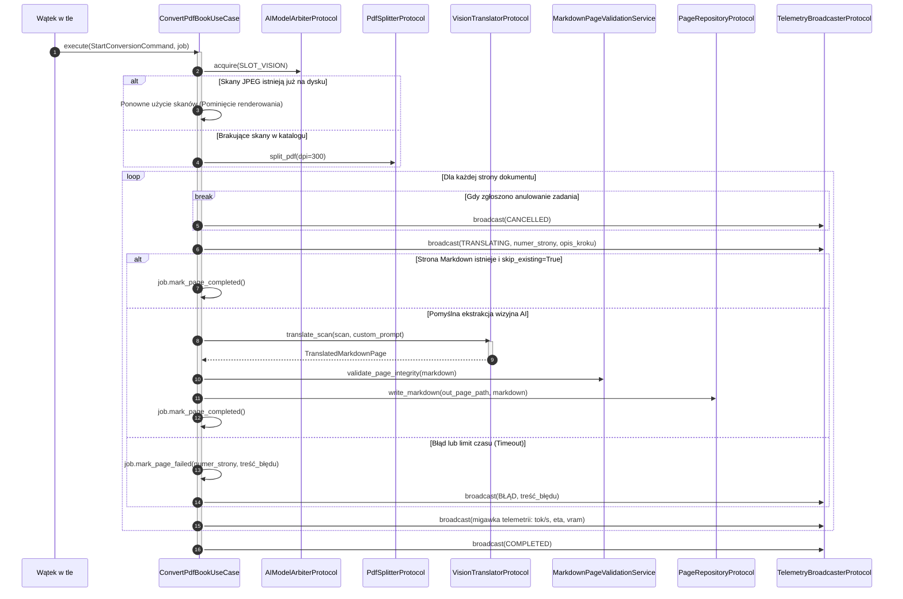

# Przypadek użycia: tłumaczenie i ekstrakcja wizyjna AI

## Przegląd

Przypadek użycia `ConvertPdfBookUseCase` (`lektor.application.use_cases.convert_pdf_book`) koordynuje multimodalny potok konwersji: rasteryzację dokumentu, weryfikację skanów, inferencję modelu wizyjnego, ochronę kodu oraz emisję telemetrii w czasie rzeczywistym.

---

## 1. Przebieg potoku wykonawczego

---

## 2. Kontrakt komendy wejściowej

Potok przyjmuje komendę `StartConversionCommand`:

| Pole | Typ | Opis |
| --- | --- | --- |
| `pdf_path` | `Path` | Ścieżka do pliku źródłowego PDF. |
| `book_slug` | `str` | Identyfikator książki w formacie kebab-case. |
| `dpi` | `int` | Rozdzielczość rasteryzacji skanów (domyślnie 300). |
| `page_range` | `tuple[int, int] \| None` | Zakres stron do przetworzenia lub `None` (całość). |
| `skip_existing` | `bool` | Pomija strony z istniejącym plikiem Markdown. |
| `custom_prompt` | `str \| None` | Opcjonalny prompt sterujący tłumaczeniem technicznym. |

---

## 3. Niezmienniki i odporność operacyjna

1. **Wywłaszczanie VRAM**: Przed wysłaniem zapytań do serwera wizyjnego przypadek użycia wywołuje `arbiter.acquire(SLOT_VISION)`. Gwarantuje to, że modele TTS nie zajmują pamięci karty graficznej.
2. **Spójność atomowa zapisu**: Strona trafia do repozytorium dopiero po pomyślnej walidacji przez `MarkdownPageValidationService`. Błędnie przetłumaczone pliki nie zastępują poprawnych danych.
3. **Płynna telemetria SSE**: Każdy krok emituje zdarzenia do `TelemetryBroadcasterProtocol`, zasilając pasek postępu w Web GUI bez blokowania wątku roboczego.
