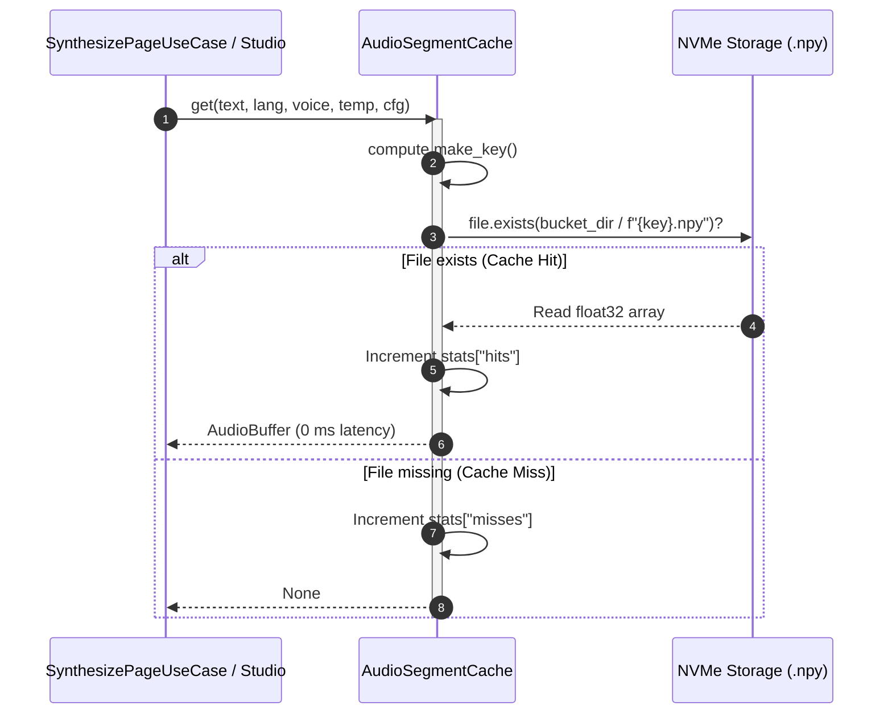

# Content-addressable audio cache (SHA-256)

## Overview

The `AudioSegmentCache` adapter (located in `lektor.adapters.tts.cache`) implements deterministic, content-addressable storage for synthesized speech utterances. By hashing synthesis configurations and normalized text, identical segments are retrieved in $0\text{ ms}$ without GPU invocation.

---

## 1. Storage layout and bucket hierarchy

To prevent filesystem performance degradation when storing tens of thousands of numpy arrays, cache files are distributed across two-character hexadecimal buckets:

```text
data/audio_book/.cache/segments/
├── manifest.json
├── 3a/
│   └── 3a7f8b91c0e...d2.npy
└── e4/
    └── e4b12c8a99f...81.npy

```

* **Array serialization**: Speech tensors are stored as single-precision 32-bit floating point binary files (`.npy`) using `numpy.save` and loaded memory-mapped via `numpy.load(..., mmap_mode="r")`.
* **Manifest index**: Tracks metadata, timestamps, hit counts, and duration metrics.

---

## 2. Key derivation algorithm

The deterministic cache key hash is computed over canonical representations of all parameters that influence vocoder output:

$$\text{key} = \text{SHA256}(\text{normalized\_text} \mathbin{\Vert} \text{lang} \mathbin{\Vert} \text{voice} \mathbin{\Vert} \text{temp} \mathbin{\Vert} \text{cfg})$$

```python
def make_key(
    self,
    text: str,
    lang: str = "pl",
    voice: Optional[str] = None,
    temperature: float = 0.35,
    cfg_weight: float = 0.7,
) -> str:
    payload = f"{text.strip()}|{lang.lower()}|{voice or ''}|{temperature:.3f}|{cfg_weight:.3f}"
    return hashlib.sha256(payload.encode("utf-8")).hexdigest()

```

---

## 3. Cache lookup and persistence sequence

