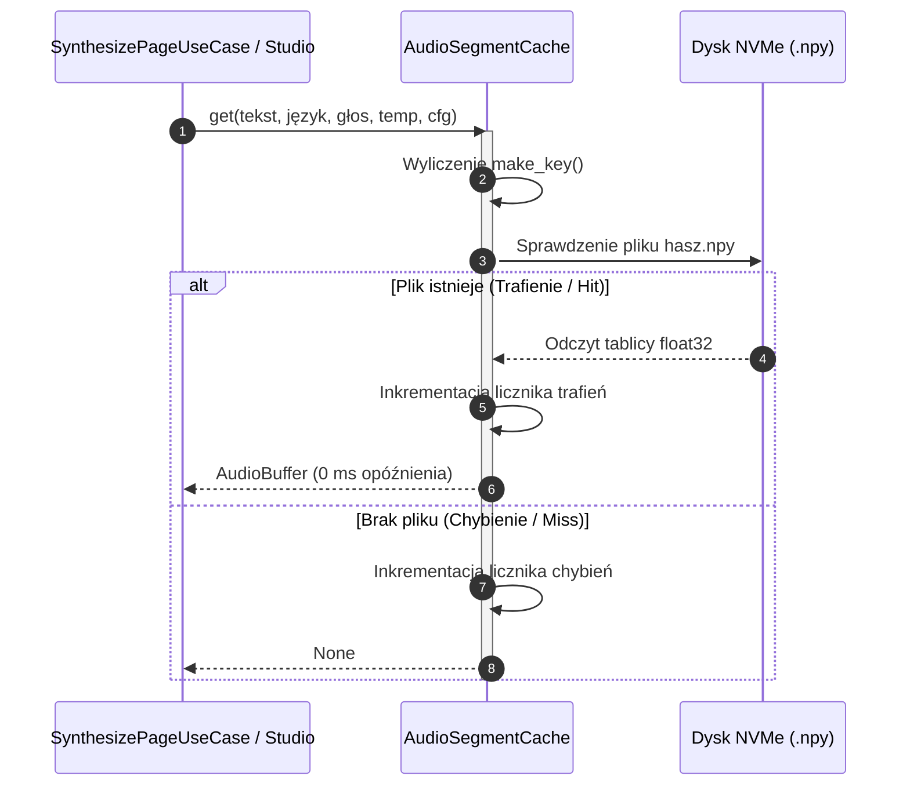

# Pamięć podręczna audio adresowana zawartością (SHA-256)

## Przegląd

Adapter `AudioSegmentCache` (znajdujący się w module `lektor.adapters.tts.cache`) implementuje deterministyczny magazyn segmentów mowy adresowany zawartością. Dzięki haszowaniu konfiguracji syntezy i znormalizowanego tekstu identyczne wypowiedzi są odczytywane w czasie $0\text{ ms}$ bez obciążania karty graficznej.

---

## 1. Układ katalogów i struktura kubełkowa

W celu uniknięcia spadku wydajności systemu plików przy dziesiątkach tysięcy próbek, tablice NumPy są rozmieszczane w dwuznakowych podkatalogach szesnastkowych:

```text
data/audio_book/.cache/segments/
├── manifest.json
├── 3a/
│   └── 3a7f8b91c0e...d2.npy
└── e4/
    └── e4b12c8a99f...81.npy

```

* **Serializacja tablic**: Bufory mowy są zapisywane jako binarne tablice 32-bitowych liczb zmiennoprzecinkowych (`.npy`) za pomocą funkcji `numpy.save` i odczytywane przez `numpy.load`.
* **Manifest indeksu**: Rejestruje metadane, znaczniki czasu, liczbę trafień oraz czas trwania wypowiedzi w pliku `manifest.json`.

---

## 2. Algorytm wyliczania klucza haszującego

Deterministyczny skrót klucza obliczany jest ze znormalizowanych wartości parametrów wpływających na brzmienie lektora:

$$\text{klucz} = \text{SHA256}(\text{znormalizowany\_tekst} \mathbin{\Vert} \text{język} \mathbin{\Vert} \text{głos} \mathbin{\Vert} \text{temperatura} \mathbin{\Vert} \text{cfg})$$

```python
def make_key(
    self,
    text: str,
    lang: str = "pl",
    voice: Optional[str] = None,
    temperature: float = 0.35,
    cfg_weight: float = 0.7,
) -> str:
    payload = f"{text.strip()}|{lang.lower()}|{voice or ''}|{temperature:.3f}|{cfg_weight:.3f}"
    return hashlib.sha256(payload.encode("utf-8")).hexdigest()

```

---

## 3. Przebieg sprawdzania i zapisu w pamięci podręcznej

