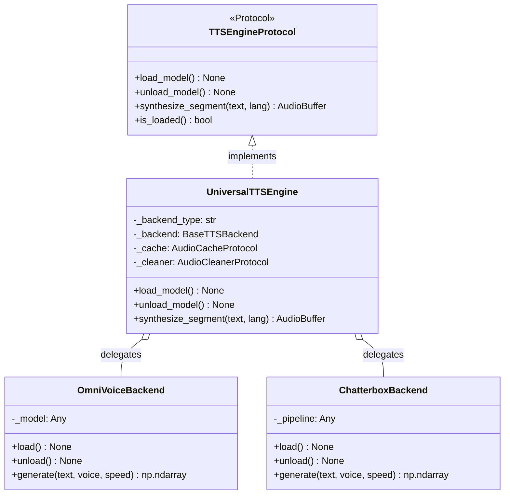

# Universal TTS engine & backend dispatch

## Overview

The `UniversalTTSEngine` adapter (`lektor.adapters.tts.universal_engine`) provides a unified implementation of `TTSEngineProtocol`. It abstracts underlying speech backends (`OmniVoiceBackend` and `ChatterboxBackend`), orchestrating model loading, device placement, and cache-assisted inference.

---

## 1. Engine hierarchy and polymorphism



---

## 2. Inference resolution workflow

When `synthesize_segment(text, lang)` is invoked:

1. **Cache query**: Evaluates `AudioCacheProtocol.get()`. If the SHA-256 hash matches, returns cached audio in $0\text{ ms}$.
2. **Model leasing**: If the backend is not yet in memory, requests initialization on the designated device (`cuda:0` or `cpu`).
3. **Backend dispatch**: Calls the active backend (`OmniVoice` or `Chatterbox`) with target voice profile, temperature ($0.33$), and CFG weight ($0.68$).
4. **Signal conditioning**: Passes output arrays through `SileroAudioCleaner.clean_tail` to eliminate trailing artifacts.
5. **Cache store**: Saves the conditioned array to disk cache via `AudioCacheProtocol.put()`.
6. **Return buffer**: Encapsulates audio in a zero-allocation `AudioBuffer`.

---

## 3. Hardware memory reclamation

The engine implements explicit VRAM eviction upon `unload_model()`:

```python
def unload_model(self) -> None:
    if self._backend:
        self._backend.unload()
    gc.collect()
    if torch.cuda.is_available():
        torch.cuda.empty_cache()
        torch.cuda.ipc_collect()
    self._is_loaded = False

```

This guarantees memory is returned to the operating system before the vision model initializes.
