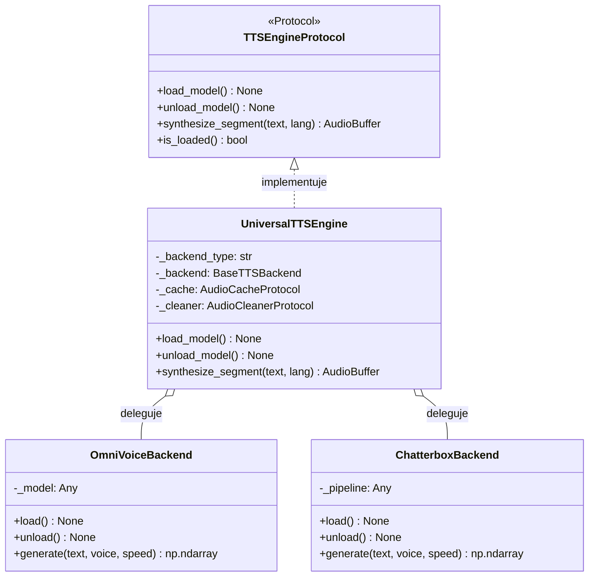

# Uniwersalny silnik TTS i dyspozytor backendów

## Przegląd

Adapter `UniversalTTSEngine` (`lektor.adapters.tts.universal_engine`) dostarcza zunifikowaną implementację kontraktu `TTSEngineProtocol`. Izoluje aplikację od konkretnych bibliotek syntezy mowy (`OmniVoiceBackend` oraz `ChatterboxBackend`), zarządzając ładowaniem wag, urządzeniami obliczeniowymi i pamięcią podręczną.

---

## 1. Hierarchia klas silnika mowy



---

## 2. Przebieg obsługi zapytania syntezy

Wywołanie metody `synthesize_segment(text, lang)` realizuje następujące kroki:

1. **Sprawdzenie pamięci podręcznej**: Odpytuje `AudioCacheProtocol.get()`. Jeśli skrót SHA-256 istnieje na dysku, zwraca gotowy bufor w czasie $0\text{ ms}$.
2. **Inicjalizacja modelu**: Jeśli model nie znajduje się w pamięci, ładuje wagi na wskazane urządzenie (`cuda:0` lub `cpu`).
3. **Delegacja wykonania**: Wywołuje aktywny backend (`OmniVoice` lub `Chatterbox`) z próbką głosu, temperaturą ($0{,}33$) i wagą CFG ($0{,}68$).
4. **Oczyszczanie sygnału**: Przekazuje wygenerowaną tablicę do `SileroAudioCleaner.clean_tail` w celu usunięcia szumu i artefaktów vocodera.
5. **Zapis w pamięci podręcznej**: Zapisuje oczyszczony bufor na dysku przez `AudioCacheProtocol.put()`.
6. **Zwrot wyniku**: Zwraca tablicę opakowaną w strukturę `AudioBuffer`.

---

## 3. Zwalnianie pamięci karty graficznej

Metoda `unload_model()` wymusza natychmiastowe zwolnienie pamięci VRAM:

```python
def unload_model(self) -> None:
    if self._backend:
        self._backend.unload()
    gc.collect()
    if torch.cuda.is_available():
        torch.cuda.empty_cache()
        torch.cuda.ipc_collect()
    self._is_loaded = False

```

Gwarantuje to odzyskanie pamięci karty graficznej przed uruchomieniem modelu wizyjnego.
