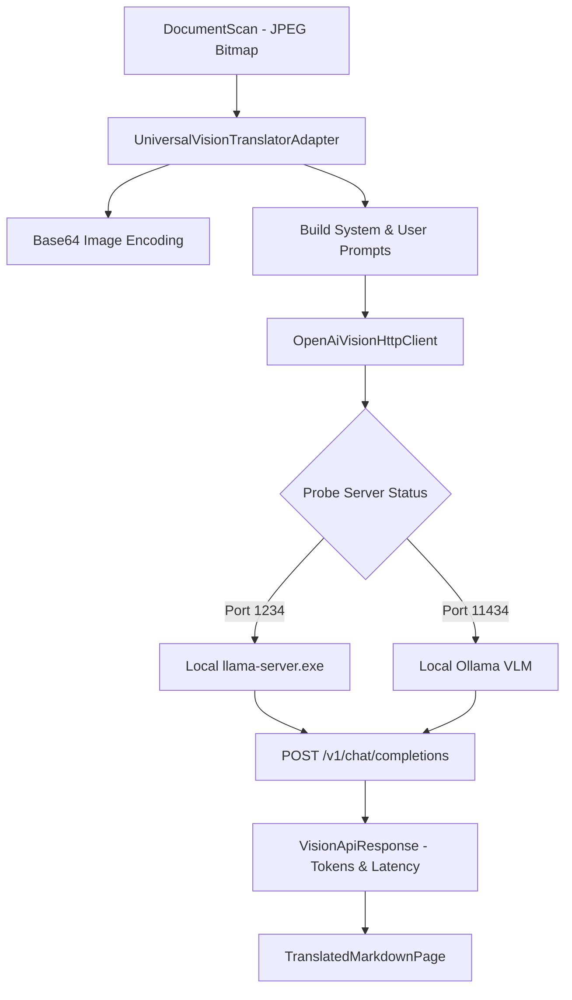

# OpenAI-compatible multimodal adapter

## Overview

The `OpenAiVisionHttpClient` adapter (`lektor.adapters.ocr.openai_vision_client`) and `UniversalVisionTranslatorAdapter` (`lektor.adapters.ocr.vision_adapter`) implement communication with local or remote multimodal vision endpoints following the OpenAI Chat Completions API standard (`/v1/chat/completions`).

---

## 1. Adapter structure and discovery

The adapter supports multiple inference backends (e.g. `llama-server.exe`, LM Studio, Ollama) by probing candidate endpoints:



---

## 2. Multimodal request payload schema

Images are transferred as Base64-encoded Data URIs within user content parts:

```json
{
  "model": "google/gemma-4-12b",
  "temperature": 0.2,
  "max_tokens": 4096,
  "messages": [
    {
      "role": "system",
      "content": "Jesteś ekspertem systemów rozproszonych i tłumaczem technicznym..."
    },
    {
      "role": "user",
      "content": [
        {
          "type": "text",
          "text": "Przetłumacz poniższą stronę techniczną na język polski. Zachowaj kod Go i diagramy Mermaid."
        },
        {
          "type": "image_url",
          "image_url": {
            "url": "data:image/jpeg;base64,/9j/4AAQSkZJRgABAQ..."
          }
        }
      ]
    }
  ]
}

```

---

## 3. Metrics calculation and telemetry parsing

The client extracts latency and generation throughput metrics from the response:

* **Tokens per second**:

$$\text{throughput} = \frac{\text{completion\_tokens}}{\text{duration\_sec}}$$


* If token count metadata is omitted by the backend, the adapter computes a reliable estimate:

$$\text{estimated\_tokens} = \left\lceil \frac{\text{len}(\text{raw\_content})}{3.5} \right\rceil$$


* Returns a structured `VisionApiResponse(raw_content, tokens_per_sec, total_tokens, duration_sec)`.
