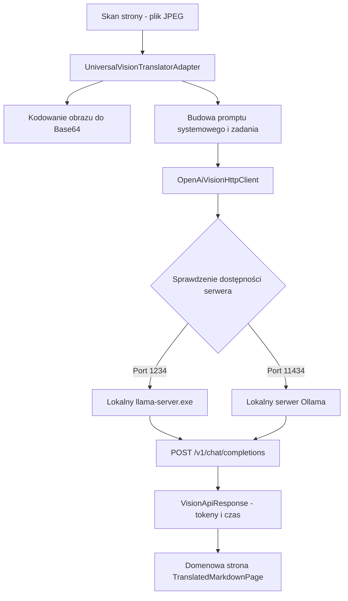

# Adapter modeli multimodalnych kompatybilny z API OpenAI

## Przegląd

Adaptery `OpenAiVisionHttpClient` (`lektor.adapters.ocr.openai_vision_client`) oraz `UniversalVisionTranslatorAdapter` (`lektor.adapters.ocr.vision_adapter`) implementują integrację z lokalnymi i zewnętrznymi serwerami modeli wizyjnych zgodnymi ze standardem OpenAI Chat Completions API (`/v1/chat/completions`).

---

## 1. Architektura adaptera i wykrywanie serwerów

Adapter automatycznie wykrywa aktywne instancje inferencyjne (np. `llama-server.exe`, LM Studio, Ollama) poprzez odpytywanie adresów lokalnych:



---

## 2. Format zapytania multimodalnego

Skany stron są przesyłane w treści zapytania jako obrazy zakodowane w formacie Base64 z prefiksem Data URI:

```json
{
  "model": "google/gemma-4-12b",
  "temperature": 0.2,
  "max_tokens": 4096,
  "messages": [
    {
      "role": "system",
      "content": "Jesteś ekspertem systemów rozproszonych i tłumaczem technicznym..."
    },
    {
      "role": "user",
      "content": [
        {
          "type": "text",
          "text": "Przetłumacz poniższą stronę techniczną na język polski. Zachowaj kod Go i diagramy Mermaid."
        },
        {
          "type": "image_url",
          "image_url": {
            "url": "data:image/jpeg;base64,/9j/4AAQSkZJRgABAQ..."
          }
        }
      ]
    }
  ]
}

```

---

## 3. Przetwarzanie odpowiedzi i obliczanie metryk

Klient pobiera dane o czasie generowania oraz wylicza przepustowość modelu:

* **Prędkość generowania tokenów**:

$$\text{przepustowość} = \frac{\text{liczba\_tokenów}}{\text{czas\_trwania\_w\_sekundach}}$$


* W przypadku braku metryk tokenów w nagłówku odpowiedzi serwera adapter stosuje bezpieczne przybliżenie:

$$\text{szacowane\_tokeny} = \left\lceil \frac{\text{długość\_tekstu}}{3{,}5} \right\rceil$$


* Wynik zwracany jest w obiekcie wartości `VisionApiResponse(raw_content, tokens_per_sec, total_tokens, duration_sec)`.
