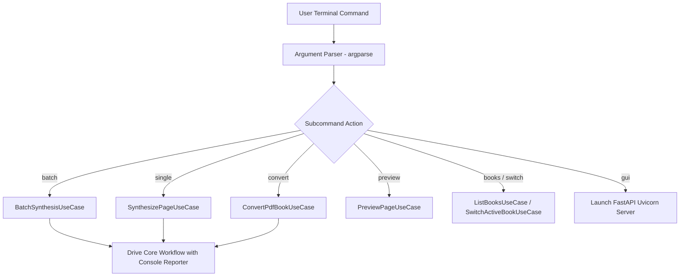

# CLI command dispatch & argument parsing

## Overview

The command-line interface adapter (`lektor.adapters.cli.main`) parses arguments, configures logging, and drives application use cases. It functions as an interface adapter within clean architecture, resolving dependencies from `ApplicationContainerProtocol` without coupling to concrete infrastructure classes.

---

## 1. Command dispatch architecture



---

## 2. Supported subcommands and options

### `batch` — Synthesizes all missing book pages

```bash
python main.py batch [--book-slug SLUG] [--force] [--format wav]

```

* `--book-slug`: Explicitly selects target book catalog.
* `--force`: Disables cache skipping (`skip_existing=False`), forcing page regeneration.

### `single` — Synthesizes an isolated page

```bash
python main.py single --page-id page_042 [--output-dir PATH]

```

* Locates `page_042.md` within the active book and executes `SynthesizePageUseCase`.

### `convert` — Executes multimodal vision PDF extraction

```bash
python main.py convert --pdf-path "book.pdf" [--start-page 1] [--end-page 50] [--dpi 300]

```

* Orchestrates `ConvertPdfBookUseCase` using `ConsoleProgressReporter`.

### `preview` — Generates linguistic normalization output

```bash
python main.py preview --page-id page_042 [--mode bilingual]

```

* Runs `PreviewPageUseCase` and dumps speech segments with pause timings to console stdout.

### `gui` — Launches local web dashboard

```bash
python main.py gui [--host 127.0.0.1] [--port 7860]

```

* Initializes `lektor.adapters.gui.app.create_app` via Uvicorn.
