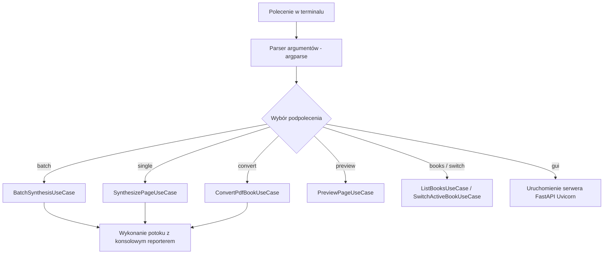

# Dyspozytor poleceń CLI i przetwarzanie argumentów

## Przegląd

Adapter wiersza poleceń CLI (`lektor.adapters.cli.main`) przetwarza argumenty konsoli, konfiguruje rejestrowanie zdarzeń oraz uruchamia odpowiednie przypadki użycia. Pełni rolę adaptera interfejsu w czystej architekturze, pobierając zależności z kontraktu `ApplicationContainerProtocol` bez powiązań z konkretnymi klasami infrastruktury.

---

## 1. Architektura dyspozytora poleceń



---

## 2. Obsługiwane polecenia i parametry

### `batch` — Synteza wsadowa wszystkich brakujących stron

```bash
python main.py batch [--book-slug SLUG] [--force] [--format wav]

```

* `--book-slug`: Wskazuje docelową książkę w magazynie.
* `--force`: Wyłącza pomijanie istniejących plików audio (`skip_existing=False`), wymuszając regenerację.

### `single` — Synteza pojedynczej wskazanej strony

```bash
python main.py single --page-id page_042 [--output-dir SCIEZKA]

```

* Odnajduje plik `page_042.md` w aktywnej książce i uruchamia `SynthesizePageUseCase`.

### `convert` — Konwersja pliku PDF przez model wizyjny AI

```bash
python main.py convert --pdf-path "ksiazka.pdf" [--start-page 1] [--end-page 50] [--dpi 300]

```

* Uruchamia potok `ConvertPdfBookUseCase` z raportowaniem w terminalu.

### `preview` — Podgląd normalizacji lingwistycznej tekstu

```bash
python main.py preview --page-id page_042 [--mode bilingual]

```

* Wykonuje `PreviewPageUseCase` i wypisuje wygenerowane segmenty mowy wraz z pauzami na standardowe wyjście konsoli.

### `gui` — Uruchomienie lokalnego serwera przeglądarkowego

```bash
python main.py gui [--host 127.0.0.1] [--port 7860]

```

* Uruchamia serwer Uvicorn z aplikacją utworzoną przez `lektor.adapters.gui.app.create_app`.
