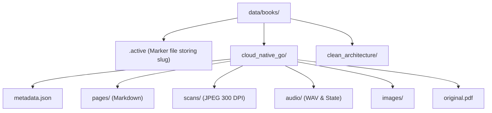

# File system book repository

## Overview

The `FileSystemBookRepository` adapter (`lektor.adapters.storage.book_repository`) implements `BookRepositoryProtocol`. It serves as the Single Source of Truth (SSOT) managing book workspaces, catalog scanning, metadata storage, and dynamic active context tracking under `data/books/`.

---

## 1. Directory layout and catalog discovery

---

## 2. Protocol operations

### `get_book(slug_or_title)`

Resolves a book by its directory slug or exact title. If found, reads `metadata.json` and constructs a domain `Book` entity bound to canonical `BookPaths`.

### `list_books()`

Iterates over directories inside `data/books/`, discovering registered books, validating workspace layout, and returning a collection of `Book` entities.

### `get_active_book()`

Reads `data/books/.active` to determine current context. If the file is missing or invalid, falls back to the first discovered book or auto-provisions a default workspace.

### `set_active_book(slug)`

Validates the slug (`BR-001`), writes it to `data/books/.active`, and returns the activated `Book` entity.

### `get_book_stats(slug)`

Calculates counts in zero-allocation mode:

$$\text{stats} = (\text{count}(\text{pages/*.md}), \text{count}(\text{audio/*.wav}), \text{count}(\text{scans/*.jpg}))$$
