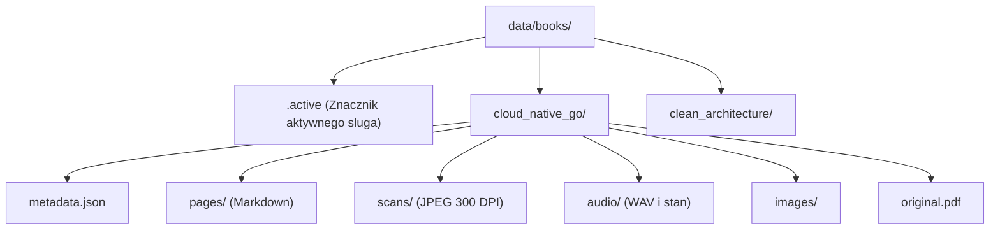

# Repozytorium książek na systemie plików

## Przegląd

Adapter `FileSystemBookRepository` (`lektor.adapters.storage.book_repository`) implementuje kontrakt `BookRepositoryProtocol`. Pełni rolę pojedynczego źródła prawdy (SSOT), zarządzając katalogami książek, skanowaniem repozytorium, metadanymi oraz znacznikiem aktywnego kontekstu w katalogu `data/books/`.

---

## 1. Układ katalogów i struktura magazynu

---

## 2. Implementacja metod portu

### `get_book(slug_or_title)`

Wyszukuje książkę po identyfikatorze katalogu (`slug`) lub dokładnym tytule. Po odnalezieniu odczytuje `metadata.json` i tworzy domenową encję `Book` powiązaną ze ścieżkami `BookPaths`.

### `list_books()`

Iteruje po podkatalogach w `data/books/`, weryfikuje ich strukturę i zwraca listę wszystkich dostępnych encji `Book`.

### `get_active_book()`

Odczytuje zawartość pliku `data/books/.active`. W przypadku braku znacznika wybiera pierwszą dostępną książkę lub tworzy domyślny katalog roboczy.

### `set_active_book(slug)`

Weryfikuje poprawność identyfikatora (`BR-001`), zapisuje go w pliku `data/books/.active` i zwraca aktywną encję `Book`.

### `get_book_stats(slug)`

Wylicza liczbę zasobów książki:

$$\text{statystyki} = (\text{pliki\_md}, \text{pliki\_wav}, \text{pliki\_skanow})$$
