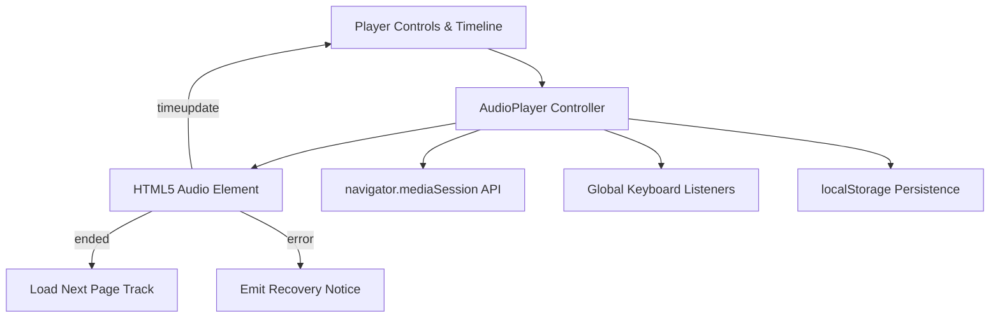

# Client-side audio player specification

## Overview

The audio player module (`static/js/player.js`) implements client-side playback, timeline scrubbing, volume control, track switching, and integration with the system Media Session API. Written in native vanilla ECMAScript (ES modules), it avoids heavy framework dependencies while providing desktop keyboard shortcuts and synchronization with the Markdown reader.

---

## 1. Player architecture & state

---

## 2. Core features & invariants

1. **System media integration**: Synchronizes track metadata (book title, page title, chapter) with the browser `navigator.mediaSession` API, enabling hardware media keys (play, pause, next, previous) on headsets and keyboards.
2. **Keyboard shortcuts**:
* `Space`: Toggle play / pause (when focus is outside text input fields).
* `ArrowLeft` / `ArrowRight`: Seek backwards or forwards by 5 seconds.
* `Ctrl + ArrowLeft` / `Ctrl + ArrowRight`: Navigate to the previous or next page track.

3. **Playback rate memory**: Preserves selected playback rate (from `0.75x` to `2.0x`) across sessions via `localStorage`.
4. **Range requests compatibility**: Consumes audio streams served with HTTP `206 Partial Content` headers, enabling smooth timeline seeking without buffering the entire WAV file.
