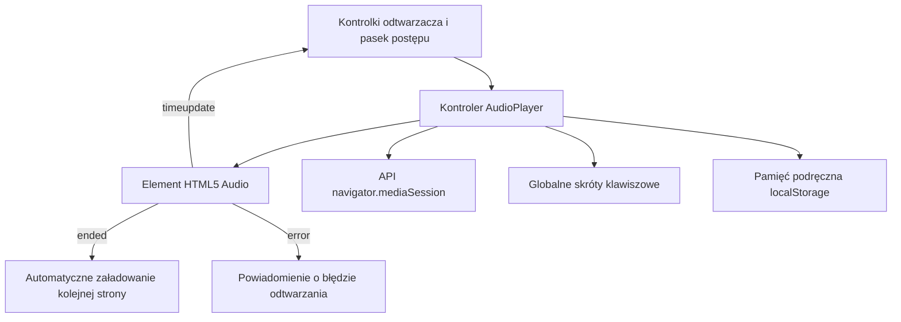

# Odtwarzacz audio po stronie przeglądarki

## Przegląd

Moduł odtwarzacza audio (`static/js/player.js`) odpowiada za odtwarzanie nagrań w przeglądarce, przewijanie osi czasu, kontrolę głośności, przełączanie stron oraz integrację z systemowym API Media Session. Napisany w natywnym standardzie ECMAScript (moduły ES), działa bez zewnętrznych frameworków, udostępniając skróty klawiszowe i synchronizację z czytnikiem Markdown.

---

## 1. Architektura odtwarzacza i zarządzanie stanem

---

## 2. Funkcje kluczowe i niezmienniki

1. **Integracja z systemem operacyjnym**: Rejestruje metadane odtwarzania (tytuł książki, stronę) w interfejsie `navigator.mediaSession`, umożliwiając sterowanie odtwarzaniem za pomocą przycisków multimedialnych na klawiaturze i słuchawkach.
2. **Skróty klawiaturowe**:
* `Spacja`: Wznowienie lub zatrzymanie odtwarzania (poza polami edycji tekstu).
* `Strzałka w lewo` / `w prawo`: Przewijanie utworu o 5 sekund wstecz lub w przód.
* `Ctrl + Strzałka w lewo` / `w prawo`: Przejście do poprzedniej lub następnej strony książki.

3. **Pamięć tempa odtwarzania**: Wybrana prędkość lektora (od `0,75x` do `2,0x`) jest zapamiętywana w `localStorage` i przywracana po przeładowaniu strony.
4. **Płynne przewijanie strumienia**: Odtwarzacz korzysta z nagłówków HTTP `206 Partial Content`, co umożliwia natychmiastowe przewijanie nagrania bez konieczności pobierania całego pliku WAV.
