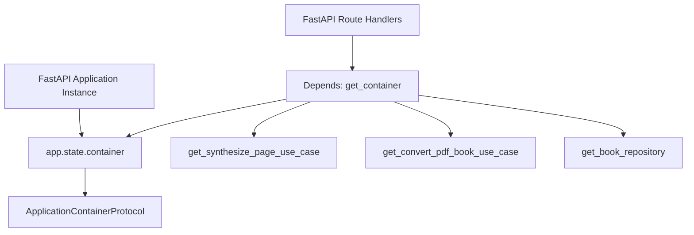

# Dependency injection & application state

## Overview

In the web interface adapter, dependency injection is structured around FastAPI dependencies (`fastapi.Depends`) coupled with application-level state (`app.state`). This mechanism keeps HTTP routing handlers decoupled from concrete instantiation logic while granting access to `ApplicationContainerProtocol`.

---

## 1. Wiring topology



---

## 2. Dependency providers

Defined in `lektor.adapters.gui.dependencies`:

```python
def get_container(request: Request) -> ApplicationContainerProtocol:
    """Retrieves the unified composition root container from FastAPI state."""
    return cast(ApplicationContainerProtocol, request.app.state.container)

def get_job_manager(request: Request) -> JobExecutionManager:
    """Retrieves thread-safe background job execution manager."""
    return cast(JobExecutionManager, request.app.state.job_manager)

def get_broadcaster(request: Request) -> TelemetryBroadcasterProtocol:
    """Retrieves SSE telemetry broadcaster."""
    return cast(TelemetryBroadcasterProtocol, request.app.state.broadcaster)

```

---

## 3. Dynamic book context reconfiguration

When a request to switch the active book arrives (`/api/books/switch`), the router executes `SwitchActiveBookUseCase` and calls:

```python
container = get_container(request)
container.reset_book_context(new_paths)

```

This purges repository caches in-place, rebinding all subsequent request dependencies to the newly selected book catalog.
