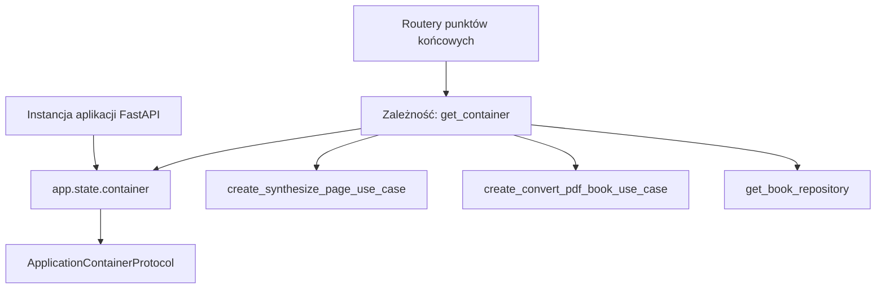

# Wstrzykiwanie zależności i stan aplikacji

## Przegląd

W warstwie interfejsu przeglądarkowego wstrzykiwanie zależności bazuje na mechanizmie `fastapi.Depends` zintegrowanym ze stanem aplikacji (`app.state`). Rozwiązanie to uniezależnia routery HTTP od tworzenia instancji klas, zapewniając bezpośredni dostęp do kontraktu `ApplicationContainerProtocol`.

---

## 1. Topologia powiązań



---

## 2. Dostawcy zależności

Zdefiniowani w module `lektor.adapters.gui.dependencies`:

```python
def get_container(request: Request) -> ApplicationContainerProtocol:
    """Pobiera kontener punktu składania aplikacji ze stanu FastAPI."""
    return cast(ApplicationContainerProtocol, request.app.state.container)

def get_job_manager(request: Request) -> JobExecutionManager:
    """Pobiera menedżera bezpiecznego wykonywania zadań w tle."""
    return cast(JobExecutionManager, request.app.state.job_manager)

def get_broadcaster(request: Request) -> TelemetryBroadcasterProtocol:
    """Pobiera nadajnik telemetrii Server-Sent Events."""
    return cast(TelemetryBroadcasterProtocol, request.app.state.broadcaster)

```

---

## 3. Dynamiczne przełączanie kontekstu książki

Gdy użytkownik zmienia aktywną książkę (`/api/books/switch`), router wykonuje przypadek użycia `SwitchActiveBookUseCase`, po czym wywołuje:

```python
container = get_container(request)
container.reset_book_context(nowe_sciezki)

```

Powoduje to natychmiastowe wyczyszczenie pamięci podręcznej repozytoriów i powiązanie kolejnych żądań HTTP z nowym katalogiem książki.
