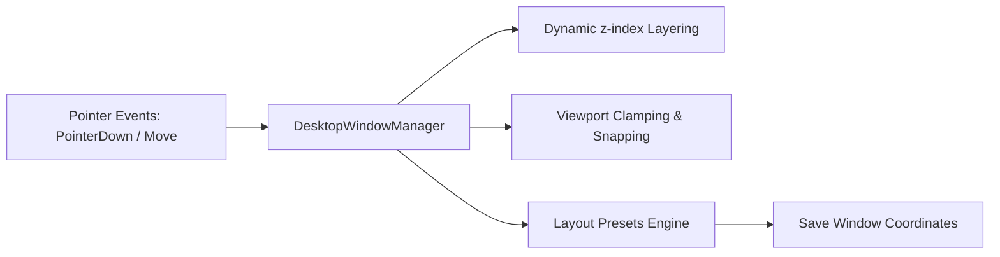

# Desktop workspace window manager

## Overview

The desktop workspace manager (`static/js/desktop.js`) provides an in-browser multi-window environment. It enables moving, resizing, layering, and snapping modules (Markdown reader, audio player, studio editor, scratchpad notes, conversion console) without external windowing libraries.

---

## 1. Layout management and window models

---

## 2. Window operations & constraints

1. **Dragging & pointer capture**: Uses `setPointerCapture` on window title bars, providing smooth cursor tracking across iframes and audio players without mouse-release glitches.
2. **Magnetic edge snapping**: Snaps windows to viewport edges when dragged within 12 pixels of boundaries.
3. **Layer elevation**: Clicking anywhere inside a window brings it to the top of the workspace stack by incrementing the global `z-index` counter.
4. **Built-in workspace presets**:
* `default`: Balanced layout showing reader, player, and notes.
* `reading`: Maximizes the Markdown reader and pins the audio player to the bottom.
* `study`: Places reader and notes side-by-side with studio editing active.
* `cascade`: Arranges all open windows in an offset diagonal cascade.

