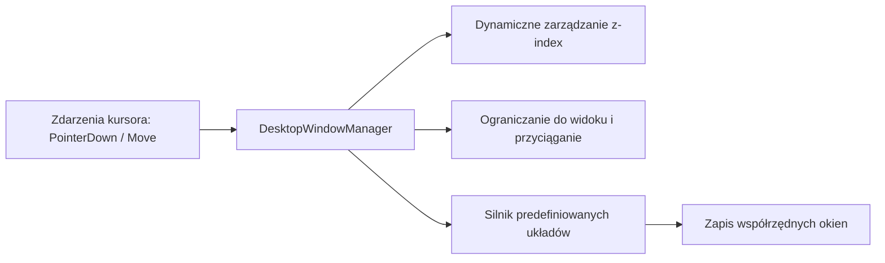

# Menedżer okien pulpitu roboczego

## Przegląd

Menedżer pulpitu roboczego (`static/js/desktop.js`) udostępnia środowisko wielookienne bezpośrednio w oknie przeglądarki. Umożliwia przesuwanie, zmianę rozmiaru, układ warstwowy i przyciąganie modułów (czytnik Markdown, odtwarzacz audio, studio nagrań, notatnik, konsola konwersji) bez używania ciężkich bibliotek zewnętrznych.

---

## 1. Architektura menedżera okien

---

## 2. Operacje na oknach i reguły zachowania

1. **Przesuwanie i przechwytywanie wskaźnika**: Wykorzystuje metodę `setPointerCapture` na paskach tytułowych okien, zapewniając płynne przesuwanie kursora bez gubienia zaznaczenia nad odtwarzaczem audio.
2. **Magnetyczne przyciąganie do krawędzi**: Okna automatycznie wyrównują się do krawędzi ekranu przy zbliżeniu na odległość poniżej 12 pikseli.
3. **Zarządzanie stosem warstw**: Kliknięcie w dowolny obszar okna wynosi je na wierzch pulpitu poprzez inkrementację licznika `z-index`.
4. **Predefiniowane układy pulpitu**:
* `default`: Zrównoważony widok z czytnikiem, odtwarzaczem i notatkami.
* `reading`: Maksymalizuje czytnik Markdown z przypiętym odtwarzaczem na dole.
* `study`: Układ czytnika i notatnika obok siebie do analizy materiału.
* `cascade`: Rozmieszcza wszystkie aktywne okna w kaskadzie po przekątnej.

