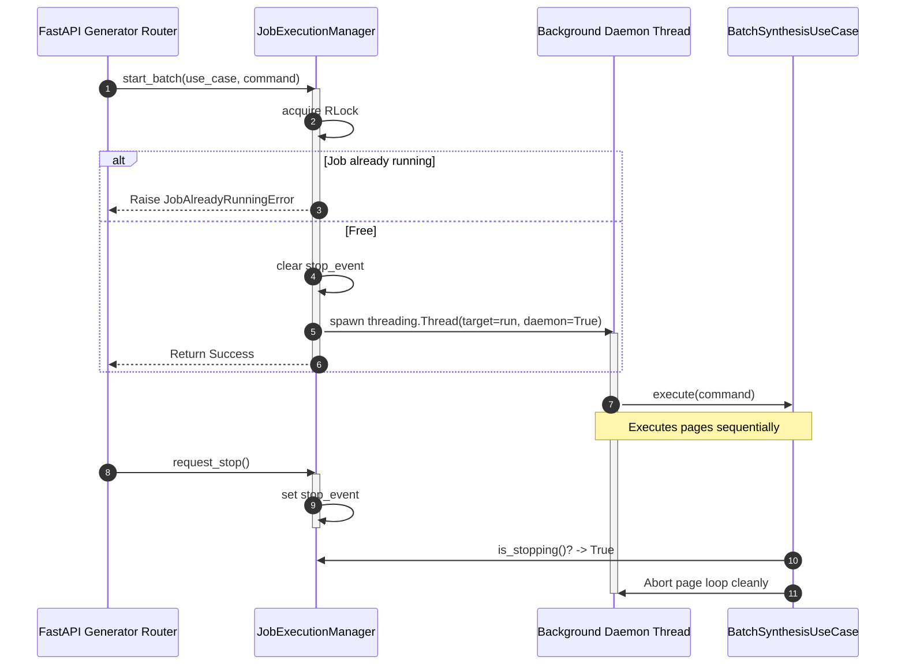

# Job execution & thread safety

## Overview

The `JobExecutionManager` adapter (`lektor.adapters.gui.jobs`) provides thread-safe orchestration for long-running batch synthesis tasks and conversion jobs executed within background threads.

---

## 1. Concurrency model

---

## 2. Synchronization primitives

1. **Reentrant mutex (`threading.RLock`)**: Protects shared state dictionaries, active generation identifiers, and worker pointers against race conditions during status queries.
2. **Cancellation signaling (`threading.Event`)**: Acts as a cooperative abort flag. When `/api/generator/stop` is invoked, `stop_event.set()` signals workers to halt processing after finishing the active utterance.
3. **Daemon threads (`daemon=True`)**: Background workers run in daemon mode, ensuring they do not prevent application shutdown when Uvicorn terminates.
